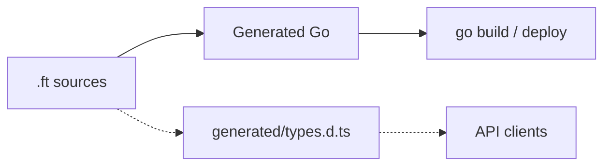

Forst is a **backend language** with structural types, validation built into the type system, and output that lives in the Go ecosystem. Write `.ft` files and ship with `go build`. Less boilerplate at the HTTP boundary and in your domain logic.

<CardGroup cols={3}>
  <Card title="Validate at the boundary" icon="shield-check">
    Attach constraints to your types so untrusted input is rejected before it reaches your logic.
  </Card>
  <Card title="Full Go ecosystem" icon="/icons/golang.svg">
    Modules, packages, tests, CI, and deployment on the standard Go toolchain.
  </Card>
  <Card title="Explicit control flow" icon="filter">
    `ensure`, nominal errors, and `Result` give you failures you can trace, written as values.
  </Card>
</CardGroup>

## How it fits your stack

You define shapes and handlers in Forst. The compiler validates them and emits Go for production. When you need shared client types, `forst generate` can emit declarations from the same source.

## Start here

<CardGroup cols={2}>
  <Card title="Why Forst?" icon="circle-question" href="/why">
    Vision, principles, and what we refuse to build.
  </Card>
  <Card title="Quickstart" icon="rocket" href="/quickstart">
    Install, write your first `.ft` file, run it.
  </Card>
  <Card title="Language overview" icon="book" href="/language/overview">
    Go shaped syntax, structural types, explicit control flow.
  </Card>
  <Card title="Validated shapes" icon="table-columns" href="/language/shapes-and-constraints">
    Types as schemas with built-in constraints.
  </Card>
  <Card title="Go interop" icon="/icons/golang.svg" href="/interop/go">
    Import Go packages; mix `.ft` with `.go`.
  </Card>
</CardGroup>

## Who this is for

Backend developers who want **Go's runtime and deployment** with **less validation boilerplate** and **stronger types**, whether you are starting fresh or mixing Forst into an existing module.

<Info>
  Forst is actively developed. Some features (Result types, Go import loading, sidecar) are **experimental**. See the [roadmap](/resources/roadmap) for current status.
</Info>

## Examples and packages

- **Compiler examples:** [github.com/forst-lang/forst/tree/main/examples/in](https://github.com/forst-lang/forst/tree/main/examples/in)
- **npm compiler:** [`@forst/cli`](https://www.npmjs.com/package/@forst/cli)
- **Gradual adoption:** [`@forst/sidecar`](https://www.npmjs.com/package/@forst/sidecar), for invoking Forst from Node during migration

For client type generation, see [TypeScript interop](/interop/typescript).
