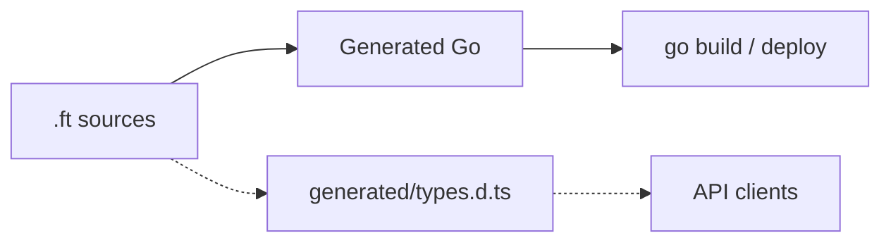

import CatalogOrder from "/snippets/catalog-order.mdx";

Forst is a programming language that brings TypeScript's type safety and developer experience to Go.

## Motivation

Our primary goal is to help you move away from TypeScript on the backend:

- Generate **instantly re-usable TypeScript types** from backend endpoints – enabling full-stack development without build steps.
- **Strong static typing with aggressive inference and smart narrowing** – so you move fast while staying safe.
- Data types that **automatically validate deeply nested input data** – to keep untrusted user input out of your application logic.

<CatalogOrder />

<Info>
  Forst is actively developed. Some features (Result types, Go import loading, sidecar) are **experimental**. See the [roadmap](/resources/roadmap) for current status.
</Info>

## How it fits your stack

Run `forst generate` when clients need TypeScript types from the same source.

## Start here

<CardGroup cols={2}>
  <Card title="Why Forst?" icon="circle-question" href="/why">
    Design priorities and what Forst omits.
  </Card>
  <Card title="Quickstart" icon="rocket" href="/quickstart">
    Install, write your first `.ft` file, run it.
  </Card>
  <Card title="Language overview" icon="book" href="/language/overview">
    Go shaped syntax, structural typing, explicit control flow.
  </Card>
  <Card title="Validated shapes" icon="table-columns" href="/language/shapes-and-constraints">
    Types as schemas with built-in constraints.
  </Card>
  <Card title="Go interop" icon="/icons/golang.svg" href="/interop/go">
    Import Go packages. Mix `.ft` with `.go`.
  </Card>
</CardGroup>

## Examples and packages

- **Compiler examples:** [github.com/forst-lang/forst/tree/main/examples/in](https://github.com/forst-lang/forst/tree/main/examples/in)
- **npm compiler:** [`@forst/cli`](https://www.npmjs.com/package/@forst/cli)
- **Gradual adoption:** [`@forst/sidecar`](https://www.npmjs.com/package/@forst/sidecar), for invoking Forst from Node during migration

For client type generation, see [TypeScript interop](/interop/typescript).
