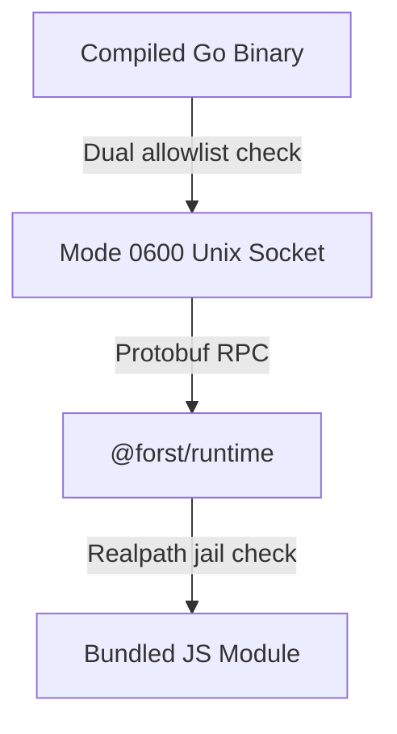

When compiled Forst code calls JavaScript functions, it uses a local bridge process. This page analyzes the security model, attack surfaces, and defensive controls built into the bridge.

## Threat model

The bridge is a local process to process communication boundary. A compiled Go binary talks to a JavaScript runtime like Node, Bun, or Deno over a local Unix domain socket.

Both processes run on the same host machine within the same trust zone. The bridge design assumes an attacker might try to force the bridge process to load arbitrary files, execute unlisted exports, or escape project directories.



## Dual allowlists

The compiler records every imported module and export during build time. It embeds this list into the Go binary as a manifest allowlist.

The allowlist uses dual enforcement.

1. **Go client check** — The Go runtime checks the manifest before sending an RPC request over the socket. If a requested module or export is missing from the manifest, Go rejects the call locally.
2. **JavaScript runtime check** — When `@forst/runtime` receives an RPC request, it rechecks the manifest in memory. If the export or module is missing from the allowlist, the runtime returns error code `-32001` (`forbidden`) without calling dynamic import.

### Allowlist widening protection

During development, `forst dev` reuses the running bridge process across code reloads. When Go sends a new `initialize` message, `@forst/runtime` verifies the new manifest.

If a new manifest attempts to add exports that were absent from the initial startup allowlist, the runtime rejects the message. This prevents process reuse attacks from expanding callable capabilities.

## Path traversal and symlink jailing

The bridge resolves requested module identifiers against project boundaries using strict path validation.

### Syntax checks

Before touching the file system, the runtime validates module identifiers.

- Module paths must be relative POSIX paths.
- Absolute paths are rejected.
- Paths containing `..` parent directory segments are rejected.
- Specifiers with `file://` or non standard protocols are rejected.
- References to `node_modules` are rejected.
- Excluded file patterns from `ftconfig.json` are rejected.

### Realpath jailing

Syntax checks alone cannot stop symlink traversal. The runtime resolves both the boundary directory and target file using real path resolution (`fs.realpath`).

This resolves all symlinks and junctions before execution. The runtime verifies that the target path stays inside the boundary root or `FORST_BRIDGE_MODULES_DIR`. If a symlink points to a file outside the jail root, the call fails with a forbidden error.

The runtime also verifies that the resolved path points to a regular file. This blocks attempts to open device nodes or directories.

## Socket permissions and process isolation

The bridge uses Unix domain sockets on Linux and macOS. Socket files created under `.forst/` use file mode `0600`. Only the operating system user account owning the process can read or write to the socket.

### Single leader binding

In host mode, Go starts your application shim process. To prevent child worker processes like Vite or Remix workers from binding the same socket, Go sets `FORST_BRIDGE_HOST_LEADER=1` only on the direct child.

Worker processes inheriting environment variables detect that they lack leader status. They skip socket binding and log a skip event. The host socket also rejects duplicate client connections to prevent unauthorized connection sharing.

### Subprocess argument safety

Go passes runtime arguments directly to child processes using structured argument arrays. Preload flags like `--import` or `--preload` are passed on process execution arguments.

Go avoids setting `NODE_OPTIONS` for host registration. This prevents environment variable leakage from infecting nested child processes.

## Restricted RPC surface

The bridge transport uses length prefixed Protobuf frames (`forst-node-proto-v1`). The protocol exposes only eight fixed method handlers.

- `forst.node/initialize`
- `forst.node/call`
- `forst.node/callAsync`
- `forst.node/genOpen`
- `forst.node/genNext`
- `forst.node/genNextBatch`
- `forst.node/genClose`
- `forst.node/shutdown`

There are no RPC methods for arbitrary code evaluation, string execution, or file system access. Requests with unknown method names return a forbidden response immediately.

## Sandboxing with Deno

When using Deno as the bridge host, Forst applies explicit permission flags at process spawn.

```text
deno run --allow-read=… --allow-write=… --allow-env --allow-net=127.0.0.1
```

Permissions are scoped strictly to the project root, socket directory, and loopback network interfaces.

## Troubleshoot security errors

Use this table to find and resolve security enforcement errors reported by the bridge.

| Error | Cause | Solution |
| --- | --- | --- |
| `forst.node/forbidden` | Export or module not in embedded manifest allowlist | Add the `js` import directive in Forst source and rebuild the program |
| `moduleId escapes boundaryRoot` | Resolved path escapes jail root via symlink or traversal | Keep JS files inside project root or set `FORST_BRIDGE_MODULES_DIR` to the bundle directory |
| `initialize cannot widen export allowlist` | Process reuse attempt to add new uncompiled exports | Restart `forst dev` when adding new JS imports |
| `EACCES` on socket file | User account mismatch on Unix domain socket | Run the Go binary and bridge host under the same user account |
| `host_skip_non_leader` | Worker process attempted socket bind without leader status | Keep `hostAutoRegister` enabled so only the leader process binds the socket |

## Related

<CardGroup cols={2}>
  <Card title="Import and call JavaScript" icon="code" href="/interop/bridge/import-and-calls">
    JS import directives and function call patterns.
  </Card>
  <Card title="Build, deploy, and runtime modes" icon="server" href="/interop/bridge/build-and-runtime">
    Host selection, compiled modules, and deployment setup.
  </Card>
</CardGroup>
