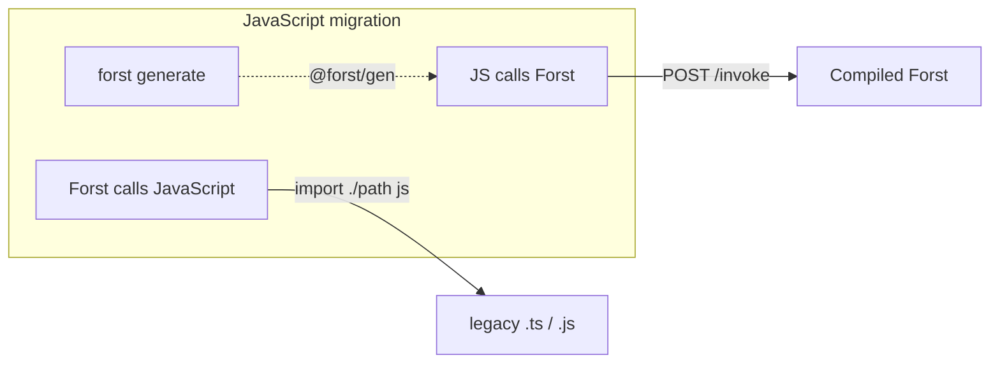

import NodeClientSetupNote from "/snippets/node-client-setup-note.mdx";

JavaScript backends often need three things when adopting Forst: **generated client types**, **calling Forst functions over HTTP**, and **testing and security controls**.

<NodeClientSetupNote />

```typescript
import { $auth } from "@forst/gen/auth";

const { valid } = await $auth.VerifyPassword({
  plainPassword: "secret",
  passwordHash: "$2a$...",
});
```



## Start here

| Goal | Guide |
| --- | --- |
| Get a typed client into your app | [Generate a TypeScript client](/interop/invoke/generate-types) |
| Call Forst functions from Express, Remix, or scripts | [Call Forst over HTTP](/interop/invoke/call-forst) |
| Secure the local invoke socket and process boundary | [Invoke security](/interop/invoke/security) |
| Stub Forst in unit or integration tests | [Testing](/interop/invoke/testing) |
| Use Effect with generated clients | [Effect mode](/interop/invoke/effect) |
| Call legacy JavaScript from compiled Forst (opposite direction) | [Call JavaScript from Forst](/interop/bridge) |

## Related

<CardGroup cols={2}>
  <Card title="Installation" icon="download" href="/installation#generated-typescript-client">
    `@forst/cli`, `postinstall`, and first generate.
  </Card>
  <Card title="Mix with Go packages" icon="golang" href="/interop/go">
    Forst compiles to Go — import stdlib and third-party packages.
  </Card>
  <Card title="Dev server" icon="server" href="/workflow/dev-server">
    `forst dev` HTTP contract for local iteration.
  </Card>
</CardGroup>
