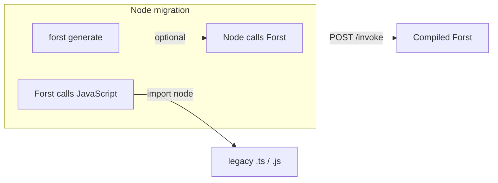

Node backends often need three things at once during migration: **shared types**, **call Forst from Node**, and **call legacy `.ts`/`.js` from compiled Forst**. You can use one, two, or all three.

The three paths and how they connect:

## Pick your path

| I want to… | Read |
| --- | --- |
| Share types between Forst and my Node app | [Generate client types](/interop/node/generate-types) |
| Call Forst functions from Express, Remix loaders, or scripts | [Call Forst from Node](/interop/node/call-forst) |
| Call existing `.ts`/`.js` modules from compiled Forst | [Call JavaScript from Forst](/interop/node/call-javascript) |
| Hot-reload while editing `.ft` files | [Dev server](/workflow/dev-server) |

<Info>
  `forst generate` emits TypeScript stubs, but the invoke wire protocol is JSON over HTTP. Any Node runtime works — Express, Remix, plain `node`. Examples use `.ts` because that is what the generator outputs.
</Info>

## Caveats

Node interop paths are at different maturity levels. Read the caveats on the page that matches your path.

- **Generated types are structural only.** No runtime constraint rules in `.d.ts`. [Generate client types § Caveats](/interop/node/generate-types#caveats)
- **Invoke from Node** (dev server, built-in HTTP server, **`@forst/sidecar`**, **`@forst/client`**) is experimental. [Call Forst from Node § Caveats](/interop/node/call-forst#caveats)
- **Call legacy JavaScript from Forst** (`import node`, [`forst/nodert`](https://github.com/forst-lang/forst/tree/main/forst/nodert)) is experimental and may require Node in the deploy image. [Call JavaScript from Forst § Caveats](/interop/node/call-javascript#caveats)

## Related

<CardGroup cols={2}>
  <Card title="Mix with Go packages" icon="golang" href="/interop/go">
    Forst compiles to Go — import stdlib and third-party packages.
  </Card>
  <Card title="Dev server" icon="server" href="/workflow/dev-server">
    `forst dev` HTTP contract for local iteration.
  </Card>
</CardGroup>
