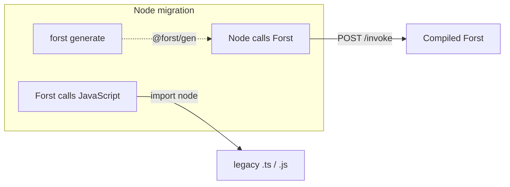

Node backends often need three things at once during migration: **a typed client**, **call Forst from Node**, and **call legacy `.ts`/`.js` from compiled Forst**. You can use one, two, or all three.

```bash
npm install @forst/cli
```

```json
{
  "scripts": {
    "postinstall": "forst generate ."
  }
}
```

```bash
npx forst generate .
```

```typescript
import { ComparePassword } from "@forst/gen/bcrypt";

const { valid } = await ComparePassword({
  plainPassword: "secret",
  passwordHash: "$2a$...",
});
```

The three paths and how they connect:


```mermaid
flowchart LR
  subgraph nodePath [Node migration]
    GenTypes["forst generate"]
    NodeToForst["Node calls Forst"]
    ForstToJS["Forst calls JavaScript"]
  end

  GenTypes -.->|"@forst/gen"| NodeToForst
  NodeToForst -->|"POST /invoke"| ForstBinary[Compiled Forst]
  ForstToJS -->|"import node"| LegacyJS["legacy .ts / .js"]
```

## Pick your path

| I want to… | Read |
| --- | --- |
| Get a typed client into my app | [Generate a TypeScript client](/interop/node/generate-types) |
| Call Forst functions from Express, Remix loaders, or scripts | [Call Forst from Node](/interop/node/call-forst) |
| Stub Forst in tests | [Testing](/interop/node/testing) |
| Use Effect with the generated client | [Effect mode](/interop/node/effect) |
| Call existing `.ts`/`.js` modules from compiled Forst | [Call JavaScript from Forst](/interop/node/call-javascript) |
| Hot-reload while editing `.ft` files | [Dev server](/workflow/dev-server) |

<Info>
  `forst generate` emits a linked package at `@forst/gen`. The invoke wire protocol is JSON over HTTP. Any Node runtime works — Express, Remix, plain `node`. Add the `postinstall` script so fresh checkouts regenerate the client.
</Info>

## Caveats

Node interop paths are at different maturity levels. Read the caveats on the page that matches your path.

- **Generated types are structural only.** No runtime constraint rules in declarations. [Generate a TypeScript client § Caveats](/interop/node/generate-types#caveats)
- **Invoke from Node** (dev server, built-in HTTP server, generated `@forst/gen` client) is experimental. [Call Forst from Node § Caveats](/interop/node/call-forst#caveats)
- **Call legacy JavaScript from Forst** (`import node`, [`forst/nodert`](https://github.com/forst-lang/forst/tree/main/forst/nodert)) is experimental and may require Node in the deploy image. [Call JavaScript from Forst § Caveats](/interop/node/call-javascript#caveats)

## Related

<CardGroup cols={2}>
  <Card title="Mix with Go packages" icon="golang" href="/interop/go">
    Forst compiles to Go — import stdlib and third-party packages.
  </Card>
  <Card title="Dev server" icon="server" href="/workflow/dev-server">
    `forst dev` HTTP contract for local iteration.
  </Card>
</CardGroup>
