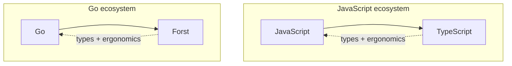
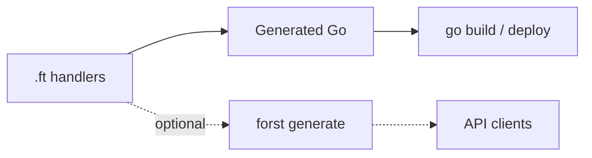

Backend work pulls in two directions: **typed boundaries** where API shapes and validation matter, and a **production runtime** where compile speed, binaries, and ops matter. Forst is for teams that need both without separate schemas for the server and clients.

<Columns cols={2}>
  <Card title="TypeScript" icon="/icons/typescript.svg">
    Structures data with types and keeps client-side boilerplate low.
  </Card>
  <Card title="Go" icon="/icons/golang.svg">
    Compiles fast, ships static binaries, and scales in production.
  </Card>
</Columns>

You define shapes, constraints, and handlers in **`.ft`**. The compiler validates them and emits Go for `go build`. Run **`forst generate`** when API clients need matching TypeScript types from the same definitions.

## The analogy

TypeScript added types on top of JavaScript while keeping the same runtime. Forst does the same for Go: you still `go build`, with typed boundaries layered on top.

## What you get

If you already model APIs with TypeScript types, Forst gives you the same shape-first workflow on the server: structural types, validation built in, and a compile target your ops team can deploy.

<CardGroup cols={2}>
  <Card title="Structural types on the server" icon="table-columns">
    Define request and response shapes as typed records. Field access, function signatures, and narrowing with **`is`** work the way you expect from TypeScript, without maintaining a parallel schema layer.
  </Card>
  <Card title="Validation on the type" icon="shield-check">
    Attach constraints (`Min`, `Max`, `Present`, custom guards) directly to fields. The compiler checks known values at compile time and emits runtime checks at the boundary before your handler logic runs.
  </Card>
  <Card title="Matching TypeScript for clients" icon="/icons/typescript.svg">
    Run **`forst generate`** to emit **`.d.ts`** from the same **`.ft`** definitions the server uses. Frontend and BFF code import types that structurally match production, not a hand-maintained copy.
  </Card>
  <Card title="Production Go output" icon="/icons/golang.svg">
    Handlers and domain logic transpile to readable Go. Ship with **`go build`**: static binaries, existing modules, tests, and CI. You gain a Go backend without giving up typed boundaries.
  </Card>
  <Card title="Explicit failures" icon="route">
    Use **`ensure`**, nominal **`error`** types, and **`Result`** to model failures as values in control flow. Narrow success and failure branches the way you would with discriminated unions in TypeScript.
  </Card>
  <Card title="Gradual adoption" icon="plug">
    Mix **`.ft`** with hand-written **`.go`** in one module. Call **`forst dev`** or **`@forst/sidecar`** from Node while you migrate route by route. Type export stays optional until clients need it.
  </Card>
</CardGroup>

## Design priorities

<CardGroup cols={3}>
  <Card title="Structural typing" icon="table-columns">
    API payloads are records with known fields. Shape matters more than inheritance.
  </Card>
  <Card title="Boundary validation" icon="filter">
    Compile-time types plus runtime checks before business logic runs.
  </Card>
  <Card title="Predictable behavior" icon="compass">
    Explicit annotations where inference would lie. No hidden coercions.
  </Card>
  <Card title="Fast tooling" icon="bolt">
    Inference only in clear cases, so the compiler stays fast and diagnostics stay useful.
  </Card>
  <Card title="Go as runtime" icon="/icons/golang.svg">
    Import Go packages, mix `.ft` with `.go`, and deploy with `go build`.
  </Card>
  <Card title="APIs for consumption" icon="plug">
    Export types when you need them. Interop supports adoption; it is not the whole story.
  </Card>
</CardGroup>

## How interop fits

**Go first.** You keep the full ecosystem: module graph, third-party packages, tests, and ops. Add client declarations when full stack teams need shared shapes.

## What Forst omits

<Columns cols={2}>
  <Card title="Surprising errors" icon="ban">
    No `try` / `catch` / `throw`. Failures are values you handle or explicitly ignore; `ensure` signals intent.
  </Card>
  <Card title="Class hierarchies" icon="ban">
    Inheritance trees obscure which fields an API actually has.
  </Card>
  <Card title="Macros and metaprogramming" icon="ban">
    Control flow changes use ordinary keywords you can read top to bottom.
  </Card>
  <Card title="Runtime reflection" icon="ban">
    Wiring and validation are compile-time, not discovered via introspection.
  </Card>
  <Card title="Dependent types" icon="ban">
    Types cannot depend on runtime values.
  </Card>
  <Card title="Implicit coercions" icon="ban">
    Conversions stay visible because backend data integrity matters.
  </Card>
</Columns>

<Info>
  Panics may appear in generated Go or third-party libraries. Forst itself favors `Result` and Go's error returns.
</Info>

## Scope

<CardGroup cols={3}>
  <Card title="Go stays the runtime" icon="circle-check">
    You still run Go: modules, packages, tests, and deployment unchanged.
  </Card>
  <Card title="Backend first" icon="circle-check">
    You generate client types when you need them.
  </Card>
  <Card title="One integrated system" icon="circle-check">
    Types, validation, narrowing, and emit work together.
  </Card>
</CardGroup>

## Read more

<CardGroup cols={2}>
  <Card title="Language overview" icon="book" href="/language/overview">
    How the language feels day to day.
  </Card>
  <Card title="Roadmap" icon="map" href="/resources/roadmap">
    What exists, what's experimental, what's planned.
  </Card>
  <Card title="Quickstart" icon="rocket" href="/quickstart">
    Install and run your first handler.
  </Card>
  <Card title="Full philosophy (GitHub)" icon="github" href="https://github.com/forst-lang/forst/blob/main/PHILOSOPHY.md">
    Long-form design doc in the repository.
  </Card>
</CardGroup>
