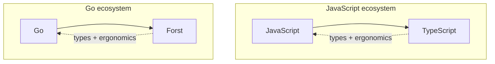
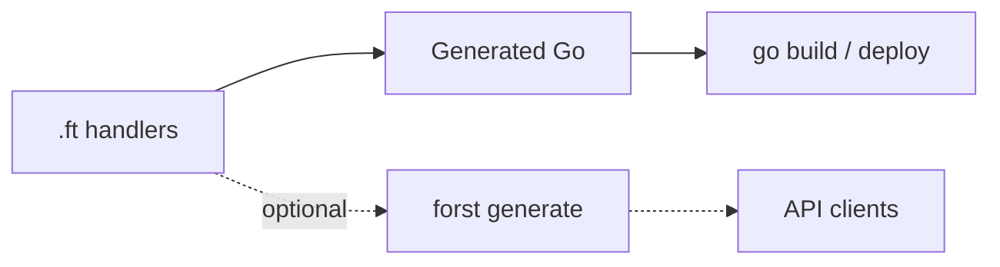

<Columns cols={2}>
  <Card title="TypeScript" icon="/icons/typescript.svg">
    Efficient at **structuring data**. Gives you great ergonomics and low boilerplate.
  </Card>
  <Card title="Go" icon="/icons/golang.svg">
    Efficient at **compile and runtime**. Strong module system and ops that scale.
  </Card>
</Columns>

Forst is the bet that backend developers should not have to choose: an **ergonomic language for backends** with the type safety of TypeScript, compiling to Go you can ship today.

## The analogy

TypeScript added types and ergonomics on top of JavaScript while keeping the same runtime. Forst does the same for Go: you still `go build`, with safer and clearer backend code layered on top.

## What we're building toward

<CardGroup cols={2}>
  <Card title="Types that guard" icon="shield-check">
    Constraints on shapes catch bad input at the HTTP boundary, replacing scattered `if` checks.
  </Card>
  <Card title="Explicit control flow" icon="route">
    `ensure`, nominal errors, and `Result` give you failures you can trace, written as values.
  </Card>
  <Card title="Full Go ecosystem" icon="/icons/golang.svg">
    Your modules, packages, tests, CI, and deployment workflow stay on the standard Go toolchain.
  </Card>
  <Card title="Optional client types" icon="arrows-left-right">
    When callers need shared shapes, `forst generate` emits from the same source.
  </Card>
</CardGroup>

## What we optimize for

<CardGroup cols={3}>
  <Card title="Structural typing" icon="table-columns">
    API payloads are records with known fields. Shape matters more than inheritance.
  </Card>
  <Card title="Boundary validation" icon="filter">
    Compile-time types plus runtime checks before business logic runs.
  </Card>
  <Card title="Predictable behavior" icon="compass">
    Explicit annotations where inference would lie. No hidden coercions.
  </Card>
  <Card title="Fast tooling" icon="bolt">
    Inference only in clear cases, so the compiler stays fast and diagnostics stay useful.
  </Card>
  <Card title="Go as runtime" icon="/icons/golang.svg">
    Import Go packages, mix `.ft` with `.go`, and deploy with `go build`.
  </Card>
  <Card title="APIs for consumption" icon="plug">
    Type export stays cheap when you need it. Interop supports adoption; it is not the whole story.
  </Card>
</CardGroup>

## How interop fits

**Go first.** The full ecosystem stays in reach: module graph, third-party packages, tests, and ops. Add client declarations when full stack teams need shared shapes.

## What we deliberately avoid

<Columns cols={2}>
  <Card title="Exceptions" icon="ban">
    Errors are values you trace, without stack jumps via `try` / `catch`.
  </Card>
  <Card title="Macros" icon="ban">
    Control flow changes use ordinary keywords you can read top to bottom.
  </Card>
  <Card title="Dependent types" icon="ban">
    Typechecking stays decidable. Tooling stays fast.
  </Card>
  <Card title="Implicit coercions" icon="ban">
    Conversions stay visible because backend data integrity matters.
  </Card>
  <Card title="Runtime type mutation" icon="ban">
    Types are fixed at compile time. No monkey patching.
  </Card>
  <Card title="Surprising errors" icon="ban">
    Failures are handled or explicitly ignored. `ensure` signals intent.
  </Card>
</Columns>

<Info>
  Panics may appear in generated Go or third-party libraries. Forst itself favors `Result` and Go's error returns.
</Info>

## Scope

<CardGroup cols={3}>
  <Card title="Go stays the runtime" icon="circle-check">
    You still run Go: modules, packages, tests, and deployment unchanged.
  </Card>
  <Card title="Backend first" icon="circle-check">
    Client types are generated when you need them.
  </Card>
  <Card title="One integrated system" icon="circle-check">
    Types, validation, narrowing, and emit work together.
  </Card>
</CardGroup>

## Read more

<CardGroup cols={2}>
  <Card title="Language overview" icon="book" href="/language/overview">
    How the language feels day to day.
  </Card>
  <Card title="Roadmap" icon="map" href="/resources/roadmap">
    What exists, what's experimental, what's planned.
  </Card>
  <Card title="Quickstart" icon="rocket" href="/quickstart">
    Try it in five minutes.
  </Card>
  <Card title="Full philosophy (GitHub)" icon="github" href="https://github.com/forst-lang/forst/blob/main/PHILOSOPHY.md">
    Canonical long-form design doc in the repository.
  </Card>
</CardGroup>
