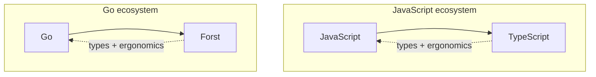

While backend engineering covers a wide surface, some central issues affect everyone:

- **Developer experience**: everyday work needs fast feedback and low boilerplate.
- **Performance**: prod needs to keep up when traffic spikes and complexity grows.
- **Contracts**: boundaries need to validate bad data before it reaches domain logic.

Forst is for teams who want all three: one `.ft` source that ships as native Go while allowing incremental migration within your existing TS or Go codebase.

<Columns cols={2}>
  <Card title="TypeScript" icon="/icons/typescript.svg">
    Keeps client-side boilerplate low and makes working with complex data easy.
  </Card>
  <Card title="Go" icon="/icons/golang.svg">
    Compiles fast, ships static binaries, and scales in production.
  </Card>
</Columns>

## The analogy

Similar to TypeScript, Forst allows working within your existing codebase and replacing more and more code over time:

TypeScript added types on top of JavaScript while keeping the same runtime. Forst does the same on both sides of your stack:

- **Go:** Ship native binaries with `go build` and typed boundaries layered on top. See [Go interop](/interop/go).
- **Node:** Stay type-aligned with the frontend and migrate route by route without a big bang rewrite. See [Node interop](/interop/node).

## Feature comparison

Compare Forst to TypeScript and Go.

### Compatibility

How each stack talks to other languages and adopts code incrementally.

| Capability | TypeScript | Go | Forst |
| --- | --- | --- | --- |
| Incremental migration | Adopt TS file by file | Mix packages over time | [Mix `.ft`, `.go`, and legacy JS/TS](/interop/node) |
| Go module ecosystem | No (WASM only) | Native | [Import Go packages](/interop/go) |
| JS / npm ecosystem | Native | No | [Call legacy JS/TS](/interop/node/call-javascript) via `import node` |
| Call backend from Node | Same runtime | No | [Generated client + HTTP invoke](/interop/node/call-forst) |
| Shared types (server ↔ client) | Straightforward | Manual / separate | [`forst generate`](/interop/node/generate-types) |

### Language

How each language models data, errors, and concurrency.

| Capability | TypeScript | Go | Forst |
| --- | --- | --- | --- |
| Static typing | Yes | Yes | Yes |
| Structural typing | Built-in | Structs (nominal) | [Built-in](/language/overview) (flexible) |
| Mocking & DI | DI libraries | Manual / Fx / Wire | [`use` / `with`](/language/providers) |
| Validation on types | Schema library (Zod, etc.) | Manual checks | [Built-in constraints](/language/shapes-and-constraints) |
| Error handling | Exceptions (`try`/`catch`) | `(T, error)` values | [`ensure`, `Result`, nominal errors`](/language/errors-and-result) |
| Type narrowing | Discriminated unions, type guards, `asserts` | Type assertions | [`is` / `ensure`](/language/ensure-and-narrowing), [type guards](/language/type-guards) |
| Exceptions | Yes (`try`/`catch`) | Yes (`panic`/`recover`) | No |
| User-defined generics | Yes | Yes | No ([built-ins](/language/overview), [planned](/resources/roadmap)) |
| Class inheritance | Yes | No (composition) | No ([shapes](/language/overview)) |
| Goroutines | Via async/await | Native (`go`) | Native ([`go` / `defer`](/interop/go)) |
| Channels | No | Native | No ([planned](/resources/roadmap)) |
| Runtime reflection | Limited | Native (`reflect`) | No (compile-time focus) |

### Infrastructure

How you ship, debug, and adopt each stack day to day.

| Capability | TypeScript | Go | Forst |
| --- | --- | --- | --- |
| Production runtime | V8, JavaScriptCore | Native | [Native Go](/interop/go) (compiled from `.ft`) |
| Execution model | JIT | Native | Native (via Go) |
| Static binary deployment | No | Yes | [Yes](/interop/go) (via Go output) |
| Language server (LSP) | Yes | Yes (gopls) | Yes ([`forst lsp`](/workflow/editor)) |
| Open source | Yes | Yes | Yes |

<Info>
  Go import loading, Node interop, Providers, and several invoke paths are **experimental**. See the [roadmap](/resources/roadmap) for current status.
</Info>

## What you get

<CardGroup cols={2}>
  <Card title="Structural typing on the server" icon="table-columns" href="/language/overview">
    Typed records with field access, signatures, and **`is`** narrowing. You define one schema layer for the server.
  </Card>
  <Card title="Validation on the type" icon="shield-check" href="/language/shapes-and-constraints">
    Constraints on fields. The compiler checks known values at compile time and emits runtime checks at the boundary.
  </Card>
  <Card title="Generate client types" icon="/icons/typescript.svg" href="/interop/node/generate-types">
    **`forst generate`** emits **`.d.ts`** from the same **`.ft`** definitions the server uses.
  </Card>
  <Card title="Production Go output" icon="/icons/golang.svg" href="/interop/go">
    Readable Go output. Ship with **`go build`**, existing modules, tests, and CI.
  </Card>
  <Card title="Explicit failures" icon="route" href="/language/errors-and-result">
    **`ensure`**, nominal **`error`** types, and **`Result`**. Failures are values you handle in control flow.
  </Card>
  <Card title="Gradual adoption" icon="plug" href="/interop/node/call-forst">
    Mix **`.ft`** with **`.go`**. Migrate route by route with **`forst dev`** or **`@forst/sidecar`**.
  </Card>
</CardGroup>

## Design priorities

<CardGroup cols={3}>
  <Card title="Structural typing" icon="table-columns">
    Shape matters more than inheritance.
  </Card>
  <Card title="Boundary validation" icon="filter">
    Types and runtime checks run before your logic.
  </Card>
  <Card title="Predictable behavior" icon="compass">
    Require explicit annotations where inference would lie.
  </Card>
  <Card title="Fast tooling" icon="bolt">
    Inference applies only in clear cases.
  </Card>
  <Card title="Go as runtime" icon="/icons/golang.svg">
    Import Go packages. Deploy with `go build`.
  </Card>
  <Card title="APIs for consumption" icon="plug">
    Export types when full stack teams need shared shapes.
  </Card>
</CardGroup>

## What Forst omits

<Columns cols={2}>
  <Card title="Surprising errors" icon="ban">
    No `try` / `catch` / `throw`. Failures are values you handle or explicitly ignore. `ensure` signals intent.
  </Card>
  <Card title="Class hierarchies" icon="ban">
    Inheritance trees obscure which fields an API actually has.
  </Card>
  <Card title="Macros and metaprogramming" icon="ban">
    Control flow changes use ordinary keywords you can read top to bottom.
  </Card>
  <Card title="Runtime reflection" icon="ban">
    Wiring and validation happen at compile time instead of through introspection.
  </Card>
  <Card title="Dependent types" icon="ban">
    Types cannot depend on runtime values.
  </Card>
  <Card title="Implicit coercions" icon="ban">
    Conversions stay visible because backend data integrity matters.
  </Card>
</Columns>

<Info>
  Panics may appear in generated Go or third-party libraries. Forst itself favors `Result` and Go's error returns.
</Info>

## Read more

<CardGroup cols={2}>
  <Card title="Language overview" icon="book" href="/language/overview">
    How the language feels day to day.
  </Card>
  <Card title="Roadmap" icon="map" href="/resources/roadmap">
    What exists, what's experimental, what's planned.
  </Card>
  <Card title="Quickstart" icon="rocket" href="/quickstart">
    Install and run your first handler.
  </Card>
  <Card title="Full philosophy (GitHub)" icon="github" href="https://github.com/forst-lang/forst/blob/main/PHILOSOPHY.md">
    Long-form design doc in the repository.
  </Card>
</CardGroup>
