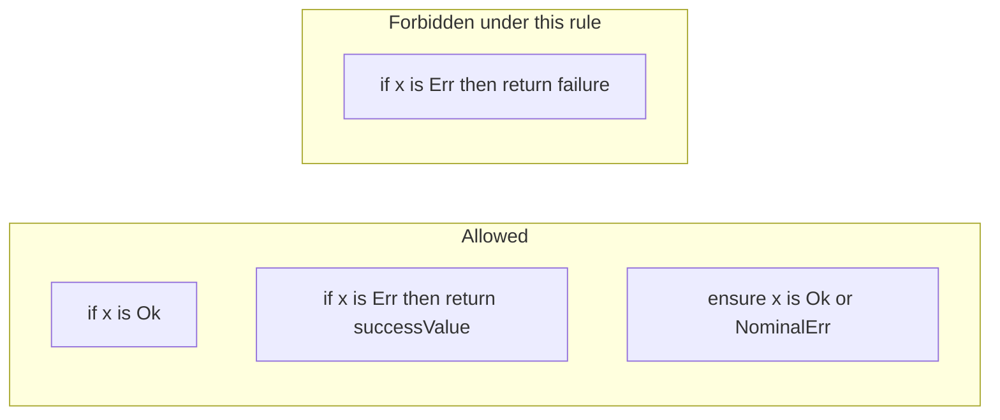

# Ensure-only failure propagation and constructor-free `Result` (RFC)

**Audience:** Language designers and compiler contributors. **Depends on** [12 §5.7](../optionals/12-result-primitives-without-ok-err.md) (constructor-free returns), [09](../optionals/09-ensure-is-narrowing-and-binary-types.md) (`ensure`, `is`, narrowing), and the [error system architecture](./00-error-system-architecture.md).

**Status:** **Normative target** for **control flow** and **construction** at **`Result`** call sites—**compiler-enforced** once implemented. **Does not** replace [12](../optionals/12-result-primitives-without-ok-err.md)’s full **construction** experiment; it **specializes** how **failure propagation** from a **`Result`** value should be written.

**Relations:** [02 — `Result` and error types](../optionals/02-result-and-error-types.md), [12 §7 — errors RFC ↔ construction](../optionals/12-result-primitives-without-ok-err.md#7-error-system-rfc--relationship-and-what-can-be-inferred), [guard / `ensure`](../guard/guard.md) (runtime + `or err`).

**Guards vs constructors ([12 §0](../optionals/12-result-primitives-without-ok-err.md#0-scope-split-guards-vs-constructors)):** **`Ok` / `Err`** stay the **built-in guards** on **`Result`** for **`is` / `ensure`**. This RFC targets **removing `Ok()`/`Err()` as value constructors** at **`return`** sites—not renaming guards.

---

## 1. Constructor-free `Result` (aligned with [12 §5.7](../optionals/12-result-primitives-without-ok-err.md))

**Goal:** Drop **`Ok()` / `Err()` as value constructors** entirely. **Success:** ordinary **`return x`** where **`x : S`**. **Failure:** **nominal** error constructors (`ParseError(...)`, `SomeError()`, struct literals, factories—not a generic **`Err(...)`** wrapper).

**Guards (narrowing):** **`Ok()` / `Err()`** on **`Result`** for **`is` / `ensure`** unchanged as **discriminants**; only **construction** at **`return`** / expression sites goes away.

---

## 2. “Can we force failure propagation through `ensure`, not `if`?”

**Yes, in a scoped sense** — but **not** as “never use `if` near errors.”

- **`if x is Ok(...)`** for success-branch work (see [`examples/in/result_if.ft`](../../../in/result_if.ft)) stays valid.
- **`if x is Err(...)`** for **recovery** must use **constructor-free success**: e.g. **`return repair(e)`** where **`repair(e) : S`**, not a legacy **`Ok(...)`** wrapper once constructors are removed.
- **Failure propagation** (early exit on **`Err`**) goes through **`ensure`**, not **`if x is Err { return failure }`**.

The intended compiler rule is **type-directed**, not a blanket ban on **`if`**.

---

## 3. Normative spelling for propagation and wrapping

Anything that used to be “unwrap or fail / wrap” must be written with **`ensure`** and a **nominal** failure on the right of **`or`**, not an **`if`** + failure **`return`**:

- **Preferred:** `ensure x is Ok() or SomeError()` (or `SomeError(wrap(e))`, etc.—whatever the nominal **`F`** constructor is).

The old pattern `if x is Err(e) { return Err(wrap(e)) }` becomes **`ensure x is Ok() or SomeError(...)`** (or a named error type carrying the wrapped value), **not** another generic **`Err`** wrapper.

---

## 4. Proposed normative rule

In a function returning **`Result(S, F)`** (and analogously for multi-return / lowered **`error`** where applicable):

1. **Forbidden:** In a branch where narrowing has selected the **`Err`** side of a **`Result`** subject (typically **`if subject is Err(...)`**’s **then** body, and symmetrically the **`else`** of **`if subject is Ok(...)`** when that **else** is the failure region—exact AST cases to match existing narrowing in [`narrow_if.go`](../../../../forst/internal/typechecker/narrow_if.go)), a **`return`** whose value is typed as **failure** / **`F`** / error-outcome is a **compile error**.
2. **Allowed:** A **`return`** of **success** / **`S`** in that same region (recovery)—**without** legacy **`Ok(...)`** constructors, once constructors are removed.
3. **Preferred spelling for propagation / wrapping:** **`ensure subject is Ok(...)`** with **`or <nominal failure expr>`** via [`EnsureNode.Error`](../../../../forst/internal/ast/ensure.go) (`EnsureErrorCall` / `EnsureErrorVar`), e.g. **`ensure x is Ok() or SomeError()`**.

**Diagnostics** should point authors at **`ensure … or …`** and mention recovery (plain **`return`** of **`S`**) as the reason **`if`** is still allowed for non-propagation paths.

---

## 5. Implementation

### 5.1 Done (compiler)

- **`if`** then-branches whose condition is **`subject is Err(...)`** on a built-in **`Result(S, F)`** increment a depth counter ([`infer_if.go`](../../../../forst/internal/typechecker/infer_if.go)); see [`ifConditionIsBuiltinResultErrNarrowing`](../../../../forst/internal/typechecker/result_err_branch_return.go).
- **`return Err(...)`** (`ErrExprNode`) in that region is rejected with a diagnostic pointing at **`ensure`** ([`checkReturnDisallowedInResultErrBranch`](../../../../forst/internal/typechecker/result_err_branch_return.go), hooked from [`infer.go`](../../../../forst/internal/typechecker/infer.go) **`ReturnNode`**).
- **`else-if`** chains use the same rule per arm.
- **Nested function bodies** reset the counter when entering a **`FunctionNode`** so inner **`return Err(...)`** is not attributed to an outer **`if … is Err`**.
- **Tests:** [`result_err_branch_return_test.go`](../../../../forst/internal/typechecker/result_err_branch_return_test.go).

**Not implemented yet:** **`else`** after **`is Ok`** (failure region without negated narrowing); arbitrary **failure-typed** returns other than **`Err(...)`** (e.g. bare **`return x`** with **`x : F`**) if the typechecker allows them; full **`S ∩ F`** disambiguation.

### 5.2 Original sketch (remaining work)

- **Where:** Extend further for **`else`-after-`is Ok`** and non-**`Err(...)`** failure returns when those are typable.
- **Edge cases:** **`ensure x is Ok() or SomeError()`** without **`or`** when propagation is default ([parser optional `or`](../../../../forst/internal/parser/ensure.go)); recovery with **`return Ok(...)`** / plain **`return`** of **`S`**.
- **Docs:** Tie-ins in [09](../optionals/09-ensure-is-narrowing-and-binary-types.md), [12 §7](../optionals/12-result-primitives-without-ok-err.md#7-error-system-rfc--relationship-and-what-can-be-inferred), and this **[errors README](./README.md)**.

---

## 6. Coverage vs [RFC 12](../optionals/12-result-primitives-without-ok-err.md) (what this plan closes vs leaves open)

Cross-check against [§4 tensions](../optionals/12-result-primitives-without-ok-err.md), [§5–5.7](../optionals/12-result-primitives-without-ok-err.md), [§6 open questions](../optionals/12-result-primitives-without-ok-err.md), and [§7](../optionals/12-result-primitives-without-ok-err.md).

### 6.1 Addressed (together with §5.7 direction)

- **Constructor removal at return sites:** plain **`return x`** (success) and **nominal** failure returns; **`ensure … or NominalErr()`** for unwrap-or-fail on a **`Result`** instead of **`if`** + failure **`return`**.
- **Failure values as domain types:** **`or SomeError()`** / **`SomeError(...)`** aligns with the error hierarchy ([12 §7](../optionals/12-result-primitives-without-ok-err.md#7-error-system-rfc--relationship-and-what-can-be-inferred))—failures read as **named** types, not a generic **`Err`** shell.
- **`ensure` as the main pump for check-shaped failures** ([12 §5.6](../optionals/12-result-primitives-without-ok-err.md), [§7.3](../optionals/12-result-primitives-without-ok-err.md#73-interaction-with-ensure-and-validation)): propagation of **`Result`** failures is pushed through **`ensure`**.
- **Guards vs constructors ([12 §0](../optionals/12-result-primitives-without-ok-err.md#0-scope-split-guards-vs-constructors)):** **`is Ok` / `is Err`** for narrowing; only **construction** changes.
- **“Not all failures are predicates on one value”** ([12 §5.6](../optionals/12-result-primitives-without-ok-err.md)): the compiler rule targets **failure returns inside narrowed `Result` failure regions**. Other failures (e.g. **`if !valid { return ValidationError(...) }`**, top-level **`return SomeError()`**) remain **ordinary** nominal **`return`**s unless you choose to model them with **`ensure`**.

### 6.2 Not fully covered (separate work)

- **`S ∩ F ≠ ∅` / ambiguous `return expr`** ([12 §4](../optionals/12-result-primitives-without-ok-err.md), [§5.1](../optionals/12-result-primitives-without-ok-err.md), [§5.7 typechecker obligations](../optionals/12-result-primitives-without-ok-err.md)): dropping constructors does **not** remove the need for **disambiguation** (annotation, `as`, or dedicated rules). **Implementation** is separate from this rule.
- **Functions with no `ensure` / inference triggers** ([12 §5.3](../optionals/12-result-primitives-without-ok-err.md)): if **`Result`** inference is **`ensure`-driven**, bodies **without** **`ensure`** still need **another rule**. **Out of scope** for the **ensure-vs-`if`-propagation** rule.
- **`if` branches returning different failure types** ([12 §5.3](../optionals/12-result-primitives-without-ok-err.md)): widening, unions, or annotations—**not** solved here.
- **Imported FFI `(T, error)` and `is` patterns** ([12 §6.2](../optionals/12-result-primitives-without-ok-err.md)): **outside** this document.
- **Migration path** ([12 §6.3](../optionals/12-result-primitives-without-ok-err.md), [§8](../optionals/12-result-primitives-without-ok-err.md)): codemod, deprecation—**process** work.
- **Teachability: guards use `Ok`/`Err`, returns do not use constructors** ([12 §5.4](../optionals/12-result-primitives-without-ok-err.md)): mitigated by **docs** and **diagnostics**, not eliminated.
- **Payload into `or SomeError(...)`:** when wrapping needs the **`Err`** payload, **`or`** must allow expressions in scope (e.g. **`SomeError(wrap(e))`** or **`SomeError(x)`** if **`x`** is still usable). **Specify and test** against real **`EnsureError*`** typing ([`EnsureNode.Error`](../../../../forst/internal/ast/ensure.go)).
- **Brevity vs auditability** ([12 §4](../optionals/12-result-primitives-without-ok-err.md)): **tradeoff** remains.
- **Errors RFC delivery** ([12 §7.4](../optionals/12-result-primitives-without-ok-err.md)): nominal types / factories must be **available** for ergonomics.

---

## 7. Related language work

- **Removing `Ok`/`Err` constructors** from the parser, inference, and codegen for **`return`** / expressions; update **examples** and **goldens** (e.g. [`examples/in/result_ensure.ft`](../../../in/result_ensure.ft), [`examples/in/result_if.ft`](../../../in/result_if.ft)).
- **Guards** keep **`Ok`/`Err`** names in **`is` / `ensure`**; narrowing and hovers stay aligned with [12 §0](../optionals/12-result-primitives-without-ok-err.md).

---

## 8. Out of scope (unless expanded later)

- **Linter-only** mode (this document targets **compiler** enforcement).

---

## Document history

| Change | Notes |
| --- | --- |
| Initial | Extracted from implementation plan: **ensure-only** failure propagation, **nominal** **`or`**, **coverage** vs [12](../optionals/12-result-primitives-without-ok-err.md); lives under **errors RFC** hub. |
| Compiler | **`return Err(...)`** in **`if x is Err()`** then-branch rejected; see **§5.1**. |
| Guards | Success guard remains **`Ok()`** (not renamed); **constructor** vs **guard** split per [12 §0](../optionals/12-result-primitives-without-ok-err.md). |
