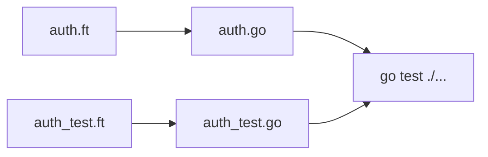

# Emit and `go test` bridge

**Status:** Draft.

**Depends on:** [01 — Command spec](./01-command-spec.md), [ADR-007](../requirements/ADR.md#adr-007-go-lowering--needs-struct-as-first-parameter), [ADR-013](../requirements/ADR.md#adr-013-needs-struct-lowering), [ADR-018](../requirements/ADR.md#adr-018-go-native-test-entrypoints).

---

## Overview

`forst test` emits Go source into a **build workspace**, then invokes **`go test`**. Production and test code share one lowering pipeline; test functions get additional rules for `ensure` and harness params.



---

## Production emit (unchanged)

- `{fn}Needs` struct per function with non-empty `Needs(f)` — **by-value** contract fields ([ADR-013](../requirements/ADR.md#adr-013-needs-struct-lowering)).
- `with` blocks → struct literals copying from ambient Usable at call sites.
- Exported symbols follow existing Go export rules.

---

## Test emit

### Test function signature

Forst:

```forst
func TestExpireToken(t *testing.T) { ... }
```

Emitted Go (same package):

```go
func TestExpireToken(t *testing.T) { ... }
```

### Harness parameter

- `*testing.T` is **not** added to any `{fn}Needs` struct.
- Lowering treats `t` like a special parameter available in test function scope.

### `ensure` in tests

| Forst | Emitted Go (sketch) |
| --- | --- |
| `ensure result is Err(Expired {})` | `t.Helper(); if !(<cond>) { t.Fatalf("...") }` |
| `ensure result is Ok() { ... }` | failure → `t.Errorf` or block body on false condition |

Mirror non-test `ensure` semantics; use **`t.Fatalf`** for hard failures unless an `ensure` block suggests recoverable reporting.

### `t.Run` subtests

Forst closures passed to `t.Run` lower to Go function literals with `*testing.T` parameter — standard Go subtest output.

### Requirements inside tests

`with ciUserApiServices() { expireToken(token) }` lowers like production:

```go
expireToken(expireTokenNeeds{
    Logger: wiring.Logger,
    Clock:  wiring.Clock,
}, token)
```

Same ambient-merge rules as [SPEC § Go lowering](../requirements/SPEC.md#go-lowering).

---

## Build workspace layout

**Option A (preferred v1):** emit beside sources or into configured `out/` directory within module root — `go test ./...` sees packages normally.

**Option B:** temp dir with generated tree + copied `go.mod` — used by sidecar executor pattern today ([`executor.go`](../../../../forst/internal/executor/executor.go)).

| Concern | Approach |
| --- | --- |
| **Module path** | Preserve module `go.mod` from workspace root |
| **Generated file names** | `basename.ft` → `basename.go`; `basename_test.ft` → `basename_test.go` |
| **Stale artifacts** | `forst test` rebuilds when `.ft` mtime newer than `.go` (future optimization) |

---

## `go test` handoff

```bash
go test -v ./path/to/package/... [forwarded flags]
```

- **`-run`** filters `Test*` names on emitted Go (same as native Go tests).
- **`-parallel`** applies to emitted tests.
- **Race detector** — `go test -race` works on emitted code like ordinary Go tests.

---

## Manual debug workflow

Authors may compile once and run Go directly:

```bash
forst run -root ./pkg --compile-only   # future flag; or existing dump/transform tooling
go test -v ./pkg/...
```

Not required for normal workflow; documented for compiler development.

---

## Implementation checklist

1. Parser: recognize test functions (`Test*` + `*testing.T` first param).
2. Typechecker: exclude harness from `Needs(f)`; validate Test* signatures.
3. Transformer: `ensure` → `t.Fatal`/`t.Errorf` in test functions; emit `*_test.go`.
4. `cmd/forst test`: discovery + emit + `exec go test`.
5. Integration test: minimal `*_test.ft` → `forst test` → pass/fail.
