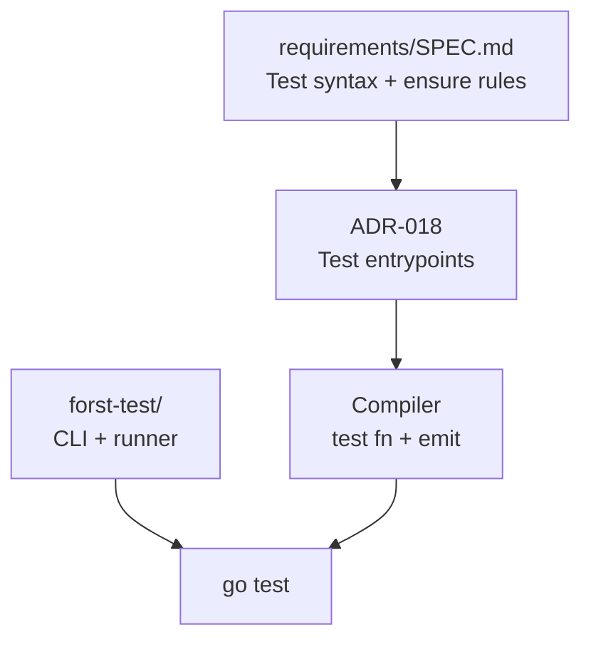

# Forst test runner (`forst test`)

RFC for the **`forst test`** CLI — discovery, compilation, and execution of Forst tests. **Test syntax** ( `Test*` + `*testing.T`, `with` wiring, `ensure` in tests) is normative in the [requirements SPEC](../requirements/SPEC.md#testing-go-native) and [ADR-018](../requirements/ADR.md#adr-018-go-native-test-entrypoints).

## Documents

| Doc | Role |
| --- | --- |
| [01 — Command spec](./01-command-spec.md) | `forst test` invocation, flags, exit codes, output |
| [02 — Discovery and layout](./02-discovery-and-layout.md) | `*_test.ft`, packages, `ftconfig.json`, merge rules |
| [03 — Emit and go test bridge](./03-emit-and-go-test-bridge.md) | `_test.go` emission, temp module layout, `go test` handoff |

## Relationship to requirements

- **Requirements RFC** owns `use` / `with` / Usable semantics inside tests.
- **This RFC** owns how tests are **found**, **compiled**, and **run**.

## Status

**Draft** — command not implemented; spec defines target behavior for implementation.
