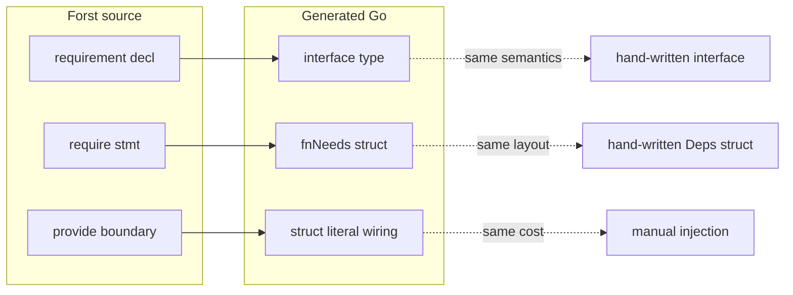

# Function requirements — design critique and alternatives

**Audience:** Language designers and RFC coordinators evaluating the consolidated normative spec ([01](./01-normative-spec.md)).

**Status:** Critical review — not normative.

**Depends on:** [00 — Prior art](./00-prior-art.md), [01 — Normative spec](./01-normative-spec.md), [02 — Examples](./02-examples.ft), [effect CLI sketch](../effect/13-simple-effect-cli.md), codebase audit in [00 §5](./00-prior-art.md#5-forst-codebase-audit-current-state).

---

## Executive summary

**Honest verdict:** The consolidated design is **worth implementing only if Forst commits to compile-time requirement propagation as a first-class checker feature**. As surface syntax alone, it is **~85% redundant with idiomatic Go** (interfaces + a deps struct + struct literals at boundaries). The RFC is candid about Go lowering; that honesty cuts both ways: the emitted code is what a careful Go author would already write.

What the design **actually adds** over plain Go:

1. **Transitive need inference** — adding `require Database` in a leaf function forces callers (transitively) to wire `Database` without manually threading an extra parameter through every intermediate signature.
2. **Compile-time wiring completeness** at entry points (`main`, `test`, handlers).
3. **Uniform test/production boundary** — `provide { … }` blocks mirror Effect mental model for the TS audience.
4. **Discovery metadata** — optional `requires` clause and JSON for sidecar/LSP.

What it **does not** add:

- No runtime capability algebra (contrast Effect `R`, ZIO layers).
- No automatic dependency graph construction at `main`.
- No escape from manual fake struct authoring in tests.
- No fundamental separation from Go interfaces — **`requirement` is a Go interface with a Forst keyword**.

**Recommendation:** Proceed with **mechanism** (inference + lowering + entry-point checking) but **reconsider the primitive**. Prefer **`type` + methods + structural satisfaction** (already idiomatic in `02-examples.ft` via `func (l StdLogger) info(...)`) over a parallel `requirement` declaration form. Keep **`provide`** (or a renamed boundary keyword) for wiring; make **`require`** optional or replaceable with **`use`** / contextual field inference where `AppContext` already exists.

If the team cannot ship inference in v1, **do not ship the syntax** — hand-written Go deps structs are simpler than keywords that lower to the same bytes without checker help.

---

## Q1: Interface overlap analysis

### What `requirement` is, mechanically

| Forst construct | Go lowering | Go-native equivalent |
| --- | --- | --- |
| `requirement Logger { info(msg String) }` | `type Logger interface { Info(msg string) }` | `type Logger interface { … }` |
| `require logger: Logger` | `logger := needs.Logger` | Local from deps param |
| `func f …` with `Req = {Logger, Clock}` | `func f(needs fNeeds, …)` | `func f(deps Deps, …)` |
| `provide { Logger: x }` | `fNeeds{Logger: x, …}` | Struct literal at call site |
| `provide ctx { … }` | Field extraction `ctx.Logger` | `deps := RequestDeps{Logger: ctx.Logger, …}` |
| Structural satisfaction | Implicit Go interface satisfaction | Same |
| Distinct names (`AuditLogger` vs `Logger`) | Distinct interface types | Same idiom |

The normative spec states the Go rule explicitly: *"If a struct field solves it, it is not a requirement mechanism — it is data layout."* That rule collapses the abstraction into **struct fields carrying interface-typed values** — exactly Go.

### Overlap diagram



### Redundancy vs necessary extension

| Aspect | Redundant with Go? | Necessary Forst extension? |
| --- | --- | --- |
| Named method-set contract | **Yes** — interface | Only if Forst lacks interface emission from types (fixable without `requirement`) |
| Deps bundling as first param | **Yes** | **Yes** — if compiler synthesizes and merges needs structs |
| Call-site struct literals | **Yes** | **Partial** — `provide forward` / scope merge reduces boilerplate |
| Transitive propagation checking | **No** in Go | **Yes** — core value |
| `provide ctx` field naming convention | **Yes** — manual mapping | **Minor** — naming sugar |
| Entry-point wiring checklist | **No** in Go | **Yes** — `forst doctor` / compile errors |
| Nominal distinct capabilities | **No** — Go uses distinct interface names | **Yes** — but achievable with `type AuditLogger = …` |
| Separation data vs capabilities | **Partial** — Go convention | **Yes** — enforced distinction is cultural + checker |

**Bottom line:** `requirement` duplicates Go's interface declaration. The **non-redundant** parts are **static analysis** (inference, propagation, entry completeness) and **boundary syntax** (`provide` blocks). The RFC bundles analysis with a new declaration primitive that the compiler does not strictly need.

### Codebase reality check

Today Forst has:

- **`type` aliases** to shapes (`type AppContext = { logger: StdLogger, … }`).
- **Methods on concrete types** (`func (l StdLogger) info(msg String)` in `02-examples.ft`) — structural satisfaction is already demonstrated in examples, not via a `requirement` decl.
- **Shape guards** — structural typing and constraints (`ensure x is Min(1)`); same subtyping story the RFC invokes for `provide ctx`.
- **No interface emission** from method-bearing types in the Go transformer — `transformFunctionParams` maps params 1:1; shapes become structs, not interfaces ([`function.go`](../../../forst/internal/transformer/go/function.go)).
- **Nominal `error X { … }`** — precedent for a dedicated decl form when Go needs a distinct named type ([`register.go`](../../../forst/internal/typechecker/register.go)).

The gap is not "we need requirements" — it is **"we need Go interface emission + deps inference."** A new keyword block duplicates interface syntax unless it enables something shapes cannot.

---

## Q2: Real help vs ceremony

### Quantified comparison (representative handler stack)

Assume: `main → handleGetUser → getUser → repo.find`, needs `Logger` + `UserRepo`.

| Approach | Forst/Go source lines (wiring + leaf) | Transitive check | Per-function Go API surface |
| --- | ---: | --- | --- |
| **Plain Go** (explicit deps param on each fn) | ~8–15 (manual struct + literals) | Manual review | N signatures × deps struct |
| **Plain Go** (shared `RequestDeps` param) | ~5–8 | Manual review | 1 context param; internal subset extraction |
| **Normative requirements** | ~6–12 (+ `require` lines in bodies) | **Compiler** | N × `fnNeeds` structs (unless merged) |
| **Requirements + `provide ctx` only** | ~4–6 at handler edge | **Compiler** | Handler keeps `AppContext`; internals synthesized |

### Where the design genuinely helps

| Scenario | Benefit | Magnitude |
| --- | --- | --- |
| Deep call tree, leaf gains new dep | Compile error at call sites / entry checklist | **High** — saves review time |
| Handler with stable `AppContext` | `provide ctx { … }` avoids repeating maps | **Medium** |
| Tests | `provide { Logger: NopLogger {} }` — readable, no mock framework | **Medium** — same as Go struct literal in test helper |
| Sidecar exports | Data-only wire + host-built context | **Medium** — policy enforcement |
| LLM test generation | Read method set → emit fake struct | **Low–medium** — works equally on `type` + methods |
| Public API documentation | Optional `requires Logger, Clock` | **Low** — JSDoc/comments achieve similar |

### Where it is ceremony without payoff

| Scenario | Problem |
| --- | --- |
| Leaf function with 1–2 deps | `require logger: Logger` + synthesized `fnNeeds` ≈ extra param with extra keywords |
| Single-package CLI (`13-simple-effect-cli` style) | `context.Context` + repo interface param is shorter |
| Cross-package wiring | Still manual at process edge — same as Go `main` |
| `provide { Logger: ctx.logger, Clock: ctx.clock }` on every explicit call | Noise when `provide ctx` block would suffice |
| Per-function `expireTokenNeeds`, `getUserNeeds`, … | Go API churn unless merge pass lands (open question in §12) |
| Conditional `require` in branch | Still counts in need set — wiring must be total; no real conditional deps in v1 |

### Break-even heuristic

| Team / codebase shape | Worth new syntax? |
| --- | --- |
| Large Forst domain layer, many internal calls, frequent new deps | **Yes** — inference pays rent |
| Thin Forst wrapper over Go libraries, handlers only | **No** — use `AppContext` fields + plain params |
| Heavy TS Effect interop, `provide` vocabulary valued | **Yes** — cultural alignment |
| Libraries exported to pure Go callers | **Marginal** — exported `fnNeeds` params are a breaking ABI |

**Skeptical summary:** Without merged needs structs and strong inference, you trade **Go-familiar brevity** for **keyword overhead** and **identical runtime cost**. The design helps most in **monorepo domain code** with **deep internal graphs**; it helps least in **handler-thin** apps — which matches the existing sidecar/`AppContext` pattern already in RFC examples.

---

## Q3: App-level override flows

### Production wiring

**Flow A — `provide ctx` at handler (normative §6.5):**

```ft
func CreateUser(input CreateUserRequest, ctx AppContext): Result(CreateUserResponse, Error) {
    provide ctx {
        return createUserInternal(input)
    }
}
```

1. Host/sidecar constructs `AppContext` once per request (logger, clock, db implementations).
2. Compiler maps `Logger` → `ctx.logger`, `UserRepo` → `ctx.db` (structural satisfaction + naming convention).
3. Internal calls inherit via scope scope inside the block; emitted Go copies fields into callee `fnNeeds` literals.

**Flow B — `main` entry:**

```ft
func main() {
    ctx := AppContext { logger: StdLogger{}, clock: SystemClock{}, db: PostgresDatabase{…} }
    provide ctx { runServer() }
}
```

**Still manual:**

- Choosing concrete implementations (`StdLogger` vs vendor SDK).
- Building `AppContext` / env config / connection pools.
- Sidecar host bootstrap (Go code outside Forst).
- Cross-package re-exports: each package emits its own interfaces; **process `main` wires once** (§5.6).
- Goroutine-scoped overrides (per-request tx) — no first-class `provide tx { … }` lifecycle; block scoping only.

### Test wiring

```ft
test "expireToken rejects expired token" {
    result := expireToken(token) provide {
        Logger: NopLogger {},
        Clock:  FakeClock { fixedMs: 2000 },
    }
    ensure result is Err(Expired {})
}
```

Or block form:

```ft
provide { UserRepo: FakeUserRepo { users: … } } {
    result := getUser("42")
    …
}
```

**Works well:** fakes are plain structs; no registry. **Still manual:** author implements every method on the fake; compiler does not generate mocks.

**Gap vs production:** Tests often use **partial** bundles (`provide Clock: …` only in Agent A agent doc) — requires scope merge rules; normative spec expects entry completeness. Test blocks must supply **full transitive need set** for calls inside the block.

### Partial override at call site

```ft
func auditAction(action String, ctx AppContext) {
    require logger: Logger
    doAction(action, provide { Logger: AuditLogger { sink: ctx.logger } })
}
```

**Mechanism:** inner `provide` shadows `Logger` for the callee; other requirements merged from scope (`provide forward` or outer scope).

**Still manual:**

- Author must know callee's full need set or rely on compiler merge from scope.
- Override map keys are requirement **idents**, not fields — extra cognitive step vs `AuditLogger` interface type.
- No automatic "use real logger everywhere except this call" — explicit map each time.

### Comparison to existing Go DI pattern in Forst RFCs

[`13-simple-effect-cli.md`](../effect/13-simple-effect-cli.md) uses:

```go
func getUserById(ctx context.Context, id int) (*User, error)
```

Business deps are **not** in `context.Context` — they'd be separate params or a host-constructed struct. The requirements RFC correctly **does not** overload `context.Context`. But the **wiring story is the same**: host builds dependencies; functions receive them.

### Override flow diagram

```
Production                          Test
──────────                          ────
main / sidecar host                 test block
    │                                   │
    ▼                                   ▼
build AppContext                   build provide map
(concrete impls)                   (Fake* structs)
    │                                   │
    ▼                                   ▼
provide ctx { handlers }           provide { … } { calls }
    │                                   │
    ▼                                   ▼
internal calls ──forward──►        same inference rules
subset fnNeeds literals
    │
    ▼
optional call-site provide { Logger: override }  ← only shadow path
```

**What the design does not solve:** application-wide **default binding registry**, **profile-based wiring** (prod/staging/dev), **decorator chains** (metrics wrapper around logger), **lifecycle** (start/stop). Those remain manual composition at `main` — as they should, per non-goals — but means Forst is not a DI framework, only a **checker + sugar**.

---

## Q4: Naming alternatives

### Critique of current names

| Name | Issue |
| --- | --- |
| **`requirement`** | Long; sounds like preconditions ("meets requirements"); overlaps with product/engineering English; not parallel to `ensure` (verb vs noun). |
| **`require`** | Collides mentally with "function requires X as param"; easy to confuse with **`requires`** clause; reads like runtime demand, not compile-time binding. |
| **`provide`** | Strong Effect-TS echo (good for TS audience); but in English also "provide data" — slightly ambiguous next to data params. |

The trio is **internally consistent** (declare → bind → satisfy) but **not** aligned with Forst's **`ensure`** pattern (single verb + payload). **`require`** is the weakest link — it describes the function's appetite, not the action of taking a capability from context.

### Candidate naming sets (ranked)

#### 1. **`capability` / `use` / `supply`** (recommended)

```ft
capability Logger { info(msg String) }

func greet(name String) {
    use logger: Logger
    logger.info("hello " + name)
}

func main() {
    supply { Logger: StdLogger {} } {
        greet("world")
    }
}
```

| Pros | Cons |
| --- | --- |
| **`use`** is short, verb-first, reads at call site ("use logger") | **`capability`** is long (abbreviate `cap` in docs?) |
| **`supply`** pairs with `use` without Effect namespace collision | **`supply`** less common than `provide` in TS Effect docs |
| Clear data vs behavior: you **use** services, pass **data** as params | Three new words if `capability` kept as decl |

#### 2. **`service` / `use` / `with`**

```ft
service Logger { … }
// body: use logger: Logger
// test: with { Logger: Fake {} } { … }
```

| Pros | Cons |
| --- | --- |
| **`with`** is familiar from Python context managers / TS | **`service`** overloaded (microservices, Windows services) |
| **`use`** again strong in body | **`with`** ambiguous — `with ctx` could mean data destructuring |
| Handler pattern: `with ctx { … }` reads naturally | Decl noun `service` fights sidecar "service" terminology |

#### 3. **`need` / `need` / `given`** (minimal decl)

```ft
type Logger = { … methods … }   // no separate decl
func f() {
    need logger: Logger           // or: given logger from ctx
}
test {
    given { Logger: Fake {} } { … }
}
```

| Pros | Cons |
| --- | --- |
| **`need`** is honest about dependency | **`need` decl + stmt** homonym stress |
| **`given`** matches math/proof style ("given these bindings") | **`given`** less standard in PLs |
| Encourages dropping separate contract keyword | **`given`** doesn't pair as cleanly as provide/supply |

**Not ranked top:** `dep`/`deps` (too abbreviated), `ensure`/`ensure` (collision with guards), `using`/`with` (Agent B — rejected for hidden boundaries).

### Naming recommendation

- **Keep one boundary verb** — `provide` is fine if Effect alignment matters; **`supply`** if Forst wants distinct branding.
- **Rename body bind** — **`use`** over **`require`**.
- **Drop or shorten decl** — prefer **`capability`** or reuse **`type`** (see Q5) over **`requirement`**.

---

## Q5: Shape/type-based alternative design

### Thesis

**Do not add `requirement` as a third type decl alongside `type` and `error`.** Instead:

1. **Capability contracts = named types with method sets** (structs with function-typed fields and/or receiver methods).
2. **Satisfaction = existing structural rules** (shape guards, method compatibility).
3. **Needs = inferred from `use` bindings and/or typed method calls**.
4. **Wiring = `supply`/`provide` blocks** (unchanged mechanism).
5. **Go lowering = emit interface from method set** (new transformer pass, not new user primitive).

This matches what `02-examples.ft` already shows: `StdLogger` implements logging via methods; `AppContext` carries concrete fields.

### Concrete syntax proposal

#### A. Method-bearing type alias (preferred)

```ft
type Logger = capability {
    info(msg String)
    error(msg String)
}

// Or sugar on shape-like syntax:
type Logger = {
    info(msg String)
    error(msg String)
} // tag: capability-only → emit Go interface, not struct
```

Implementations unchanged:

```ft
type StdLogger = { level: String }
func (l StdLogger) info(msg String) { … }
func (l StdLogger) error(msg String) { … }
```

#### B. Body binding — `use` with inference

```ft
func expireToken(token Token): Result(Token, Error) {
    use logger: Logger
    use clock: Clock
    …
}
```

**Inference rule I1:** Each `use name: T` adds `T` to `Needs(f)`.

**Inference rule I2 (optional, high value):** If `use` omitted but body contains `logger.info(…)` and `logger` resolves to a field access on an in-scope **`ctx`** parameter whose type structurally satisfies `Logger`, infer `Logger ∈ Needs(f)` and desugar to `ctx.logger`.

```ft
func handleGetUser(id String, ctx AppContext): Result(User, Error) {
    // inferred: Needs = { Logger, UserRepo } from ctx.db.find / ctx.logger
    return ctx.db.find(id)
}
```

This reduces **`use`** boilerplate where **`AppContext` already documents deps** — the handler pattern from sidecar RFCs.

#### C. Wiring — unchanged semantics, renamed

```ft
supply ctx {
    getUser(id)
}

// or partial override
audit(id, supply { Logger: AuditLogger { sink: ctx.logger } })
```

#### D. Optional export clause

```ft
func expireToken(token Token) uses Logger, Clock : Result(Token, Error) {
    use logger: Logger
    use clock: Clock
    …
}
```

`uses` reads better than `requires` (avoids `require`/`requires` collision).

### Inference rules (summary)

| Rule | Description |
| --- | --- |
| **I1 — explicit `use`** | `use x: T` ⇒ `T ∈ Req(f)` |
| **I2 — contextual field** | Method call on `ctx.field` where `typeof(field)` satisfies capability `T` ⇒ `T ∈ Req(f)` (configurable strictness) |
| **I3 — transitive calls** | `f` calls `g` ⇒ `Needs(f) ⊇ Needs(g)` |
| **I4 — entry completeness** | `main` / `test` / exported handlers: all needs supplied via `supply` or context param |
| **I5 — nominal distinction** | `type AuditLogger` and `type AppLogger` are distinct even if method sets overlap |
| **I6 — no data as capability** | Fields that carry per-request payload (user id, order) excluded by kind check — only types declared `capability` or inferred from method-only shapes |

**Default inferrability:** I2 on by default in handler-scoped functions with a `ctx`/`deps` parameter; I1 required in leaf functions without context param (stricter, explicit).

### Go lowering

| Forst | Go |
| --- | --- |
| `type Logger = capability { info(msg String) }` | `type Logger interface { Info(msg string) }` |
| `use logger: Logger` | `logger := deps.Logger` |
| `Needs(f) = {Logger, Clock}` | `type fNeeds struct { Logger Logger; Clock Clock }` |
| `supply ctx { g(x) }` | `g(fNeeds{Logger: ctx.Logger, …}, x)` |
| `StdLogger` with methods | `func (StdLogger) Info(...)` — satisfies `Logger` |

**Transformer work** (aligns with codebase gaps):

1. Detect capability kinds in `TypeDefNode` (new expr variant or annotation).
2. Emit Go `interface` instead of struct for capability types.
3. Synthesize `fnNeeds` + prepend param in `transformFunction` (extend [`function.go`](../../../forst/internal/transformer/go/function.go)).
4. Reuse shape guard structural comparison for satisfaction in `provide ctx` / field extraction.

### Comparison to normative `requirement`

| | `requirement` primitive | `type` capability |
| --- | --- | --- |
| User concepts | 3 (`type`, `error`, `requirement`) | 2 (`type`, `error`) + capability kind |
| Examples in repo | New syntax only | **`02-examples.ft` already uses methods on `type`** |
| LLM ergonomics | Read `requirement` block | Read `type Logger` + methods |
| Go emission | New decl → interface | Same emission path as nominal types |
| Risk | Parallel type systems | Capability vs data kind confusion — mitigated by keyword/tag |

### Ambitious alternative: infer from calls only (no `use`)

```ft
func expireToken(token Token, ctx AppContext): Result(Token, Error) {
    if token.expiresAt < ctx.clock.now() {
        ctx.logger.info("expired")
        …
    }
}
```

Compiler extracts needs from **resolved selector types**. **Pros:** minimal syntax. **Cons:** fragile under refactor; harder error messages ("which field supplies Clock?"); worse for functions without `ctx`. **Recommendation:** optional I2 inference, not sole mechanism.

---

## Recommended revisions to `01-normative-spec.md`

If the team keeps the normative direction, revise before implementation:

### High priority

1. **Justify or remove `requirement` primitive** — Add § comparing `requirement` vs `type … capability` with a decision matrix; default recommendation: merge into `type`.
2. **Specify needs-struct merge algorithm** — Open Q1 blocks ABI stability; normative default (one `PackageDeps` per distinct set) should be chosen.
3. **Clarify scope merge for partial `provide`** — Normative §3.3.1 vs Agent A §3.6: document exact rules when suffix map has strict subset of keys.
4. **Handler-first profile** — Normative path for `provide ctx` should be **primary** in examples; postfix `provide { Logger: ctx.logger, … }` demoted to override-only.
5. **Rename consideration** — Document `use`/`supply` as approved aliases or v2 migration targets.

### Medium priority

6. **Conditional `require` policy** — §11 says conditional still counts; either justify strongly or defer conditional use to v2 with `use?` form.
7. **Go export surface** — Document stability of synthesized struct names for Go importers; consider stable `Deps` type export.
8. **`require … from deps` sugar** — Agent A has it; normative §3.2 omits it; align or reject explicitly.
9. **Interaction with method syntax parser** — Forst examples use receivers; normative spec should reference parser/AST work for method sets on types.

### Lower priority

10. **TS emit** — Decide JSDoc `@uses` vs Effect `R` before implementation spawns two stories.
11. **Lint `provide forward` in public APIs** — Promote open Q3 to normative guidance.

### If skepticism wins (minimal v1)

**Ship only:**

- Capability kinds on `type` + Go interface emission.
- Synthesized deps struct + entry-point checking.
- `supply ctx { … }` for handlers.
- Defer `require`/`use` body statements until I2 inference exists OR keep `use` for leaf functions only.

---

## What would make this fundamentally different from Go?

Honest list of features that would **not** be sugar on interfaces:

| Feature | Fundamentally different? | In current RFC? |
| --- | --- | --- |
| Transitive compile-time propagation | Yes | **Yes** |
| Layer composition / dependency graphs | Yes | No |
| Effect rows / handler interpretation | Yes | No (explicitly rejected) |
| Linear capability types | Yes | No |
| Automatic mock codegen | Yes | No |
| Request-scoped capability types | Partial | Block scoping only |
| `requirement` keyword | No | Yes |

**Conclusion for coordinators:** The RFC's value is the **checker**, not the **keyword trio**. Consolidate primitives with existing `type` + methods, rename for `ensure`-parallel readability, and invest implementation effort in **inference + merged deps structs + handler `supply ctx`**. Without those, the design is accurately described as **Go interfaces + struct param + Effect-flavored test blocks** — acceptable for Forst's audience if the checker prevents dependency drift, insufficient if the team expected a new capability paradigm.

---

## Document status

**Critique / alternatives.** Does not supersede [01](./01-normative-spec.md). Feed revisions into the next normative revision or an implementation RFC.
