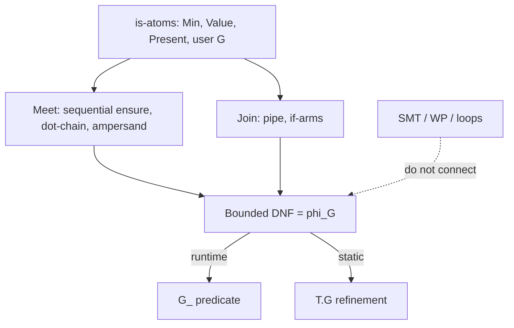

# 00 — The trap: refinement extraction and predicate implication

**Status:** Analysis. The rest of this folder is a response to this document.

---

## 1. What we are actually asking the type system to do

A type guard is sold as a **predicate that also narrows**. That is two jobs:

1. **Runtime:** `G(x)` is `true` or `false`.
2. **Static:** after `ensure x is G()`, the type of `x` is not merely `T` but **the inhabitants of `T` for which `G` holds**.

The static job is a **refinement type**:

```text
T.G  ≜  { x : T | φ_G(x) }
```

Sequential `ensure` in a guard body currently builds `φ_G` as a **conjunction** of atoms (`Min(12)`, `Present()`, …). Disjunction means `φ_G` is allowed to contain **`∨`**. Composition and subtyping then ask:

```text
T.G  <:  T.H    iff    ⊨  φ_G  ⇒  φ_H
```

That last line is the whole plot. It is **implication of predicates**. For arbitrary predicates it is undecidable. For even modest logics it is expensive and the error messages are “the checker could not prove this.” New languages reach for it because the syntax looks small (`if`, `or`, `return bool`) and the theory is not.

## 2. This is a refinement-types problem, not an `ensure` sugar problem

Refinement types (Freeman & Pfenning; Liquid Types / Rondon–Kawaguchi–Jhala) attach a **logical formula** to a **fixed base type**. They are **not** full dependent types (`Π x:T. U(x)`), where types contain terms. [PHILOSOPHY](../../../../PHILOSOPHY.md) already bans dependent types and type-level computation. Forst nevertheless already has refinements: `String.Min(3)`, `ensure x is Present()`, `Password.Strong`. Those are `{x: String | …}` with a **restricted** `…`.

The trap is expanding `…` from a **language-defined atom** to a **user-defined program**.

| Fragment | Example `φ` | Subtyping `φ ⇒ ψ` |
| --- | --- | --- |
| Finite set of named atoms | `Present ∧ Min(12)` | Syntactic: atom-set inclusion after unfold |
| Finite literal enumeration | `x ∈ {"a","b","c"}` | Set inclusion |
| Linear arithmetic | `x ≥ 12` ⇒ `x ≥ 10` | Tiny interval lattice, or SMT |
| Arbitrary boolean program | `len(x) ≥ 12 && checksum(x)` | Undecidable (Rice) |
| Programs with loops | anything | Turing-complete |

Liquid Types stay usable because **the logic is picked by the language**. Users compose atoms from that logic. They do not invent a new theory in a function body and expect the checker to understand it.

Forst already picked a logic: **`is` atoms** (built-in constraints and user guard names). TG-1 through TG-7 are an attempt to keep user guard *bodies* inside that logic. The missing piece is **`∨`**, not “more programming.”

## 3. This is also a logic-programming complexity problem

Read a type guard as a clause about the subject `x`.

**Today (Horn / definite clause):**

```text
Strong(x)  :-  Min(x, 12).
```

Conjunction of atoms. Datalog without recursion. Membership is polynomial. The compiler can *see* the body: it is a list of `ensure`.

**Disjunction (still “pure” if atoms stay `is`):**

```text
Phone(x)  :-  HasPrefix(x, "+") ; HasPrefix(x, "0").
```

Still Datalog-shaped if there is **no recursion through other guards that unfold into each other unbounded**, and no negation-as-failure games. The compiled form is **DNF**: a finite set of conjunctive paths. Size can explode (`(A∨B) ∧ (C∨D) ∧ …`), which is exactly TG-5’s “combinatorial shape paths.”

**General programs (Prolog + extra):**

```text
Strong(x)  :-  return len(x) >= 12.
Valid(x)   :-  for i in x { … }.
```

Now the body is a **Turing-complete program**. Extracting `φ` is weakest-precondition / strongest-postcondition computation over an arbitrary language. That is a program logic, not a type checker. Loops need invariants. `||` of opaque expressions is not an atom.

**The safe zone:** non-recursive definitions, finite unfolding, atoms from a closed vocabulary, DNF with a size cap. That is **Datalog-like**, not Prolog. TG-5 already said this; it did not name it.

## 4. Occurrence typing is the other theory, and it is the right one for `if`

Typed Racket (Tobin-Hochstadt & Felleisen) and TypeScript control-flow analysis do **not** prove `P ⇒ Q` about user functions. They give **tests** a propositional meaning:

```text
if  x is A()  {  /* x : A */  }  else {  /* x is not A, when A is a closed variant */ }
```

The test is in a **restricted grammar** (`typeof`, `===` literal, `is`). The type of `x` in each branch is a **split** of a union, not a synthesized formula from arbitrary code. Join at merge is **union** of the branch types.

That is what Forst’s `if x is Foo()` already is ([SEMANTICS_NARROWING](../../../../forst/internal/typechecker/SEMANTICS_NARROWING.md), `infer_if.go`). A type-guard `if` that is **the same construct** (condition must be `is`, TG-2) is occurrence typing **inside** the definition of `φ_G`: each arm is a conjunctive path; the guard is the **Join** of arms.

It is **not** “we allowed if-statements, so we can allow any condition.” TG-2 exists so the condition *is* an atom. Drop TG-2 (`if x.role == "admin"`, `if isAdmin(x)`) and you leave occurrence typing for opaque booleans. TypeScript made that trade and lives with unsound user `x is T` predicates. Forst explicitly refused that in the guard RFC.

## 5. The slope new languages slide down

Typical sequence:

1. **Want TypeScript-like user type guards.** Allow `return bool`. Extraction is impossible; the name is a **brand**. Soundness is “the author told the truth.”
2. **Want the checker to know what the guard proved.** Parse the body. Conjunction of `ensure` works. Ship that. (This is Forst today.)
3. **Users need `or`.** Add `if`, `||`, `return false`. Bodies become programs. Either:
   - stop extracting (back to brands, the checker lies about fields), or
   - start proving (SMT). Compile times and “could not prove” appear.
4. **Users need enums.** Encode them as guards with four `if`s instead of a finite union type. Now the common case is the worst encoding.
5. **Syntax collides.** `ensure x is A() or B()` used to mean **failure `B`**, not “A or B.” [12](./12-accepted-decision.md) drops `or` for **`else`** and puts Join on `|`. Do not “fix” this with `||`; that makes `ensure` a boolean language.

Sage (hybrid type checking), Whiley (constrained types + SMT), and Liquid Haskell are the existence proofs that step 3 is a product-quality hole unless the **logic is tiny and closed**. TypeScript is the existence proof that step 1 is usable **if** you put **literal unions and discriminated unions in the type grammar** and treat user guards as a side channel. Forst is trying to replace TypeScript on the backend **and** keep analyzable guards. Copying TS’s unsound predicates, or Liquid’s SMT, both miss the product.

## 6. What “analyzable” must mean here

[Guard RFC TG-5](../guard/guard.md): polynomial time, finite branching, reject combinatorial paths.

Operational definition for this RFC:

- **Unfold** a user guard **once** at its definition into a formula `φ` whose atoms are built-in constraints, literal membership, shape-field presence, and **names** of other guards (not their bodies, unless those names are inlined under a global size budget).
- **Meet** (sequential `ensure`, `.` chaining, `&`) and **Join** (`|`, if-arm union) are the same operations as binary types ([typeops](../../../../forst/internal/typechecker/typeops.go)).
- **Implication** between user formulas is **not** SMT. It is:
  - nominal: `x is G` tags `G`;
  - syntactic: after unfold, atom-set inclusion;
  - plus **small closed theories** for built-ins only (interval inclusion for `Min`/`Max`, set inclusion for literals).
- **No** weakest precondition over loops, assignments, or opaque calls.

If a predicate cannot be written as a bounded DNF of those atoms, it is **not a type guard**. It is a function. Functions do not narrow.

## 7. PHILOSOPHY tension: “no dependent types”

[PHILOSOPHY](../../../../PHILOSOPHY.md) rejects types that depend on runtime values. `{x: String | x ∈ S}` looks dependent. It is not `Π`: the **index** is not a Forst term the user computed; it is a **constraint atom** the language already compiles (`Value`, `Min`). We already ship this. The line we do not cross:

- **Allowed:** types mention a finite set of language atoms (`String.Min(3)`, `"a" | "b"`, `HasPrefix("+") | HasPrefix("0")`).
- **Forbidden:** types mention arbitrary expressions (`{x: Int | checksum(x) == 0}`, `Array(n)` where `n` is a runtime `Int`).

Disjunction of atoms stays on the allowed side. `ensure` of an arbitrary boolean does not.

## 8. The compiler hole that makes this urgent

Type-guard lowering currently emits **`return true` at the end** of `G_*` ([`transformTypeGuard`](../../../../forst/internal/transformer/go/typeguard.go)). Nested `if` that **skips** an `ensure` still succeeds. The nested-if test in the typechecker only checks that `if`/`ensure` *type-check*, not that every successful path proves the same `φ`. Relative to extraction, **fall-through is unsound**. Any design that treats `if` as disjunction must make **unmatched = fail**, not success. That is a semantic fix, not a new feature.

## 9. What this folder will not solve with one construct

Three different user sentences get one word (“union”) in conversation:

1. **This string is one of these values.** Finite carrier subset. Enum / literal union.
2. **This value of a single type satisfies P or Q.** Refinement Join on one carrier (`HasPrefix("+") | HasPrefix("0")`).
3. **This value is variant A or variant B, with different fields.** Discriminated sum. Occurrence typing on a tag. Future `match`.

Using type-guard `if` for (1) is the hack the tictactoe example already comments around. Using SMT for (2) is the trap. Using a second type system for (3) is how you get two algebras. [02](./02-three-kinds-of-union.md) splits them. [12](./12-accepted-decision.md) assigns each a construct.


