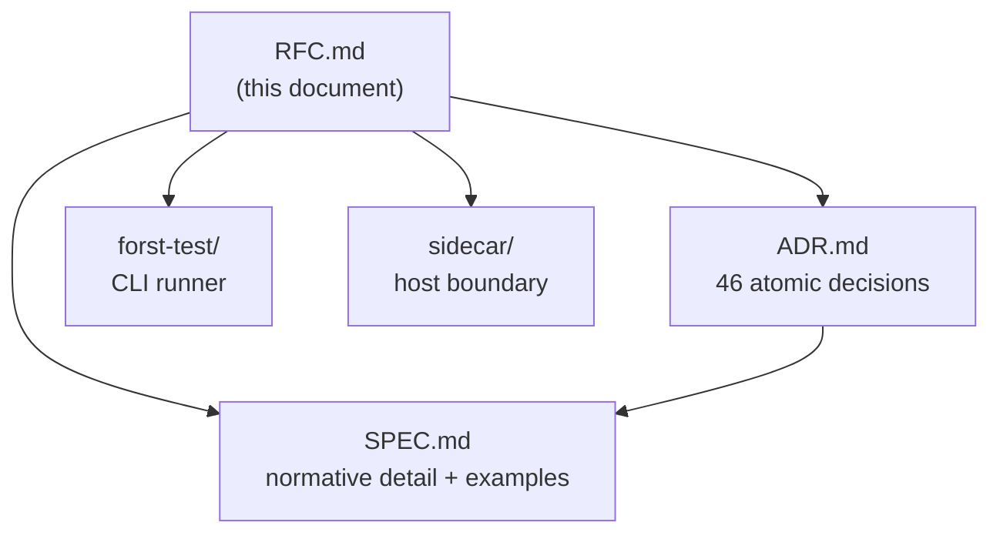

# RFC: Function requirements (`use`, `with`, Usables)

## Abstract

Forst **function requirements** let backend code declare swappable runtime services via **`use`**, wire them at scope boundaries via **`with`**, and rely on the compiler to infer **`Usables(f)`** through the call graph with mandatory completeness at wiring roots. Contracts are ordinary types; Go lowering emits deduped **Usables struct** parameters; TypeScript never sees Usables. **LSP and cross-package inference ship at GA.**

The key words **MUST**, **MUST NOT**, **SHOULD**, **SHOULD NOT**, **MAY**, and **RECOMMENDED** are to be interpreted as described in [RFC 2119](https://datatracker.ietf.org/doc/html/rfc2119).

---

## Summary

Two keywords. Types you already import. Wiring that lowers to Go a senior engineer would write by hand — with compile-time completeness hand-written Go lacks.

Business functions **`use`** services in the body. Composition roots **`with`** Usables bundles at scope boundaries. The compiler infers **`Usables(f)`** from `use` sites and transitive calls, propagates obligations to wiring roots, and errors with obligation chains when wiring is incomplete. No DI container. No test DSL. No TS exposure of services.

---

## Status and conformance

**Normative.** This RFC consolidates ADR-001–046 and [SPEC.md](./SPEC.md). There is **no** reduced “syntax only” subset ([ADR-017](./ADR.md#adr-017-no-reduced-mode-without-transitive-completeness)).

An implementation **MUST** satisfy every **MUST** / **MUST NOT** requirement in §Requirements. Feature **GA** requires: cross-package fixed-point ([ADR-035](./ADR.md#adr-035-cross-package-graph-normative-before-ga)), LSP minimum surface ([ADR-034](./ADR.md#adr-034-lsp-ships-at-feature-ga)), single graph source ([ADR-036](./ADR.md#adr-036-single-graph-source-for-checker-json-and-lsp)), and passing multi-package integration tests.

---

## Motivation

### Problem

Go backends mix per-invocation **data**, **runtime behavior** (loggers, clocks, DB pools), and **test substitution**. Hand-written constructor injection works but obligations drift: a leaf adds a dependency, intermediates update, `main` forgets a field until runtime.

Framework DI pushes wiring into reflection and global registries — opaque stack traces, heavy tests. Neither pattern gives **compile-time propagation** from a new `use` to every wiring root.

### Why not alternatives?

| Alternative | Forst choice |
| --- | --- |
| Go DI frameworks (Fx, Wire, dig) | No runtime container ([ADR-014](./ADR.md#adr-014-no-runtime-di-container-or-service-locator)); explicit struct literals at boundaries |
| Effect / ZIO Layers | Go-side Usables only; manual lifecycle; no TS `R` channel ([ADR-020](./ADR.md#adr-020-typescript-emit-excludes-usables-concept)) |
| Test DSL (`harness`, `override`) | Plain functions + `with` + `ciUserApiServices()` ([ADR-001](./ADR.md#adr-001-two-keywords-only--use-and-with)) |
| Context field inference | Never — authors write `use repo: UserRepo` ([ADR-005](./ADR.md#adr-005-context-parameters-never-contribute-to-usablesf)) |
| Postfix `f(x) with { … }` | Nested `with` only; table tests use `t.Run` ([ADR-009](./ADR.md#adr-009-no-postfix-with-on-calls), [ADR-033](./ADR.md#adr-033-trun--nested-with-permanent-table-test-path)) |

### Success criteria

Adding `use email: EmailSender` deep in a call chain errors at **`main`**, a test helper, or the sidecar host entry — with **`required by: f → g → h`** — until wiring supplies `EmailSender`. Tests swap fakes via nested `with`. TS clients invoke **runnable** endpoints with payload data only.

---

## Goals and non-goals

### Goals

- Two keywords: **`use`**, **`with`** ([ADR-001](./ADR.md#adr-001-two-keywords-only--use-and-with))
- Contracts = ordinary types ([ADR-002](./ADR.md#adr-002-contracts-are-ordinary-types))
- Inference-first **`Usables(f)`**; no author export clause ([ADR-003](./ADR.md#adr-003-no-author-written-usables-clause-on-signatures), [ADR-004](./ADR.md#adr-004-usablesf-inferred-from-use-and-transitive-calls-only))
- Always-forward ambient; nested overlay ([ADR-007](./ADR.md#adr-007-always-forward-ambient-no-with-forward), [ADR-008](./ADR.md#adr-008-nested-with-overlays-outer-wiring))
- Mandatory completeness ([ADR-015](./ADR.md#adr-015-unsatisfied-usables-are-hard-compile-errors))
- Cross-package inference before GA ([ADR-016](./ADR.md#adr-016-transitive-usables-inference), [ADR-035](./ADR.md#adr-035-cross-package-graph-normative-before-ga))
- Honest Go lowering ([ADR-012](./ADR.md#adr-012-usables-struct-as-first-parameter)–[ADR-027](./ADR.md#adr-027-first-parameter-named-usables-use-binds-from-fields))
- Go-native tests ([ADR-044](./ADR.md#adr-044-test-entrypoints-use-test-and-testingt))
- LSP at GA ([ADR-034](./ADR.md#adr-034-lsp-ships-at-feature-ga))

### Non-goals

- Runtime DI / service locator ([ADR-014](./ADR.md#adr-014-no-runtime-di-container-or-service-locator))
- Optional `use`, nil wiring, subtract/pick ([ADR-010](./ADR.md#adr-010-no-subtract-syntax-for-usables), [ADR-037](./ADR.md#adr-037-nil-forbidden-in-wiring), [ADR-039](./ADR.md#adr-039-no-optional-use-syntax))
- Postfix `with`, `with ctx`, map wiring ([ADR-009](./ADR.md#adr-009-no-postfix-with-on-calls), [ADR-030](./ADR.md#adr-030-with-takes-usable-shape-literals-only), [ADR-031](./ADR.md#adr-031-no-with-ctx-struct-forwarding))
- v1 brownfield bridge ([ADR-040](./ADR.md#adr-040-no-brownfield-bridge-syntax-v1))
- Compiler-enforced mock singletons ([ADR-029](./ADR.md#adr-029-mock-reuse-by-convention-not-compiler-enforced))
- Overloading `ensure` / `Result` for Usables ([ADR-018](./ADR.md#adr-018-orthogonal-to-ensure-and-result))

---

## Definitions

| Term | Definition |
| --- | --- |
| **Usable** | One contract slot: **root ident** + **contract type** (e.g. `Logger: Logger`) ([ADR-042](./ADR.md#adr-042-usable-and-usables-vocabulary)) |
| **`Usables(f)`** | Inferred set of Usables for function `f`; `Usables(A \| B \| C)`. **Tooling sugar only** — never author-written ([ADR-006](./ADR.md#adr-006-usablesf-is-derived-tooling-sugar-only)) |
| **Usables bundle** | Shape typedef (`CIUsables`) or inline wiring literal for `with` |
| **Usables struct** | Deduped Go emit type (e.g. `Usables_a1b2c3`); first parameter when **`Usables(f) ≠ ∅`** ([ADR-013](./ADR.md#adr-013-deduped-usables-struct-naming)) |
| **Contract type** | Shape, nominal type, imported Go interface/concrete/pointer, or wrapper |
| **Wiring root** | Scope where all reachable **`Usables(f)`** must be satisfied: `main`, test body, sidecar entry, outermost `with` |
| **Ambient Usables** | Merged wiring in effect at a call site |
| **Runnable export** | **`Usables(f) = ∅`** — eligible for TS/sidecar emit ([ADR-021](./ADR.md#adr-021-runnable-exports-only-when-usablesf-is-empty)) |
| **Satisfaction** | Ambient **`U`** satisfies call to **`f`** iff **`Usables(f) ⊆ keys(U)`** with assignable types ([ADR-043](./ADR.md#adr-043-satisfaction-relation-for-wiring)) |

**Aliases:** `type AuditLogger = Logger` shares slot **`Logger`**. **`with` keys MUST use root ident `Logger` only** ([ADR-041](./ADR.md#adr-041-root-contract-ident-only-in-with-keys)).

---

## Requirements

Normative requirements use RFC 2119 keywords. Each maps to ADR(s) in the [Decision registry](#decision-registry).

### R-LEX: Lexical

**R-LEX-1.** The surface **MUST** expose exactly two keywords, **`use`** and **`with`**, and **MUST NOT** add parallel contract/export/harness keywords (ADR-001).

**R-LEX-2.** **`use T`** **MAY** shorthand **`use lowerCamel(T): T`** (SPEC § Usables identification).

### R-TYPE: Types

**R-TYPE-1.** Contracts **MUST** be ordinary types with structural satisfaction; distinct nominal names **MUST** be distinct Usables except type aliases (ADR-002).

**R-TYPE-2.** Parameters **MUST** carry data; **`use`** **MUST** obtain runtime services (ADR-011).

**R-TYPE-3.** Implementations **MUST NOT** provide a runtime DI container or service locator (ADR-014).

**R-TYPE-4.** Usables **MUST** remain orthogonal to `ensure`, `Result`, and error types (ADR-018).

**R-TYPE-5.** Handlers **MUST** follow the same `use`/`with` rules as any function (ADR-032).

### R-INF: Inference (N1–N10)

**R-INF-1 (N1).** `use x: T` ⇒ root ident of `T` ∈ **`Usables(f)`** (ADR-004).

**R-INF-2 (N2).** Method calls on `use`-bound names **MUST** type-check against `T` (SPEC N2).

**R-INF-3 (N3).** `f` calls `g` ⇒ **`Usables(f) ⊇ Usables(g)`** minus local inner-`with` satisfaction (ADR-016).

**R-INF-4 (N4).** Wiring roots **MUST** satisfy all reachable **`Usables(f)`** — no opt-out (ADR-015).

**R-INF-5 (N5).** Nested `with` **MUST** merge: `M = (outer \ shadowedKeys) ∪ inner` (ADR-008).

**R-INF-6 (N6).** Wiring **MAY** superset callee needs; lowering copies required keys only (ADR-019).

**R-INF-7 (N7).** Wiring values **MUST** be assignable and non-nil; no optional `use` (ADR-037, ADR-039).

**R-INF-8 (N8).** Distinct nominals = distinct Usables; aliases share root slot (ADR-042).

**R-INF-9 (N9).** Unknown wiring keys **MUST** error (ADR-025).

**R-INF-10 (N10).** Satisfaction per Definitions (ADR-043).

**R-INF-11.** Context-parameter field calls **MUST NOT** contribute to **`Usables(f)`** (ADR-005).

**R-INF-12.** `*testing.T` / `*testing.B` **MUST NOT** be in **`Usables(f)`** (ADR-045).

**R-INF-13.** Signatures **MUST NOT** have author `uses` / `usables` clauses (ADR-003).

### R-WIR: Wiring

**R-WIR-1.** Inner calls in wired scopes **MUST** auto-forward ambient Usables; no opt-out (ADR-007).

**R-WIR-2.** Postfix `call() with { … }` **MUST NOT** exist (ADR-009).

**R-WIR-3.** Subtract / `pick` syntax **MUST NOT** exist (ADR-010).

**R-WIR-4.** Wiring values **MAY** be pointers if assignable (ADR-028).

**R-WIR-5.** `with <wiring> { body }` only; wiring **MUST** be Usables-shaped, not `map[K]V` (ADR-030).

**R-WIR-6.** `with ctx` struct forwarding **MUST NOT** exist (ADR-031).

**R-WIR-7.** Wiring keys **MUST** be root contract idents only (ADR-041).

### R-CHK: Checker

**R-CHK-1.** Unsatisfied Usables **MUST** be compile errors (ADR-015).

**R-CHK-2.** No reduced mode without transitive completeness (ADR-017).

**R-CHK-3.** Known-but-unused wiring keys **MUST** warn (ADR-024).

**R-CHK-4.** Sidecar/TS export with non-empty **`Usables(f)`** **MUST** error (ADR-022).

**R-CHK-5.** Completeness diagnostics **SHOULD** include obligation chains `required by: f → g → h` (SPEC § Completeness errors).

### R-EMIT: Go lowering

**R-EMIT-1.** Non-empty **`Usables(f)`** ⇒ deduped Usables struct first param by value (ADR-012, ADR-013).

**R-EMIT-2.** Fields **MUST** use contract types by value; no `*interface` (ADR-026).

**R-EMIT-3.** Parameter **MUST** be named `usables`; `use` **MUST** bind from fields (ADR-027).

**R-EMIT-4.** `with` **MUST** lower to struct literals with direct field copies only (SPEC § Go lowering).

**R-EMIT-5.** Test `ensure` **MUST** lower to `t.Helper()` + `t.Fatalf` / `t.Errorf` (ADR-046).

### R-XPKG: Cross-package

**R-XPKG-1.** Cross-package fixed-point **MUST** ship before GA (ADR-035).

**R-XPKG-2.** N3 **MUST** apply across package boundaries (ADR-016).

**R-XPKG-3.** Checker, discovery JSON, and LSP **MUST** share one graph (ADR-036).

### R-DISC: Discovery JSON

**R-DISC-1.** Go-side JSON **MUST** expose `usables` and `runnable` per function; **MUST NOT** appear in TS artifacts (ADR-023, ADR-020).

Schema: [SPEC § Discovery JSON](./SPEC.md#discovery-json).

### R-LSP: Tooling GA

**R-LSP-1.** LSP **MUST** ship at GA: `Usables(f)` hover, obligation chains, effective ambient (ADR-034).

**R-LSP-2.** Unknown keys **MUST** error; unused known keys **MUST** warn in LSP (ADR-024, ADR-025).

### R-TS: TypeScript boundary

**R-TS-1.** TS emit **MUST NOT** mention Usables, `@needs`, or `R` (ADR-020).

**R-TS-2.** TS emit **MUST** include only **`Usables(f) = ∅`** functions (ADR-021).

**R-TS-3.** v1 **MUST NOT** provide brownfield bridge syntax (ADR-040).

### R-TEST: Tests

**R-TEST-1.** Mock reuse **SHOULD** follow conventions; **MUST NOT** be compiler-enforced (ADR-029).

**R-TEST-2.** Table tests **MUST** use `t.Run` + nested `with` (ADR-033).

**R-TEST-3.** `Test*` + `*testing.T` in `*_test.ft` **MUST** be the primary entrypoint (ADR-044).

**R-TEST-4.** Go `_test.go` **MAY** call exported helpers with hand-written Usables literals (ADR-038).

---

## Detailed design

Reader-oriented expansion of §Requirements. Normative detail and examples: [SPEC.md](./SPEC.md).

### Surface syntax

#### `use`

```forst
func expireToken(token Token): Result(Token, Error) {
    use logger: Logger
    use clock: Clock
    // ...
}
```

| Form | Meaning |
| --- | --- |
| `use x: T` | Bind `x`; root ident of `T` ∈ **`Usables(f)`** |
| `use T` | Shorthand: `lowerCamel(T): T` |

#### `with`

```forst
with ciUserApiServices() {
    with { Clock: &FakeClock { fixedMs: 2000 } } {
        expireToken(token)
    }
}
```

**Forbidden:**

| Forbidden | ADR |
| --- | --- |
| Postfix `f(x) with { … }` | [009](./ADR.md#adr-009-no-postfix-with-on-calls) |
| `with ctx` | [031](./ADR.md#adr-031-no-with-ctx-struct-forwarding) |
| Subtract / pick | [010](./ADR.md#adr-010-no-subtract-syntax-for-usables) |
| Optional `use x?: T` | [039](./ADR.md#adr-039-no-optional-use-syntax) |
| Nil wiring | [037](./ADR.md#adr-037-nil-forbidden-in-wiring) |
| Author `uses` clause | [003](./ADR.md#adr-003-no-author-written-usables-clause-on-signatures) |
| `with forward` | [007](./ADR.md#adr-007-always-forward-ambient-no-with-forward) |
| Alias keys in `with` | [041](./ADR.md#adr-041-root-contract-ident-only-in-with-keys) |

#### Parameters vs `use`

| | Parameters | `use` |
| --- | --- | --- |
| Carries | Per-invocation data | Runtime services |
| In **`Usables(f)`** | No | Yes |
| Sidecar wire | Yes | No — host builds server-side |

### Always-forward and nested merge

Inside `with`, every inner call inherits merged ambient Usables. Nested `with` shadows keys for the inner scope; other keys forward from outer. Trade-off: less grep at inner calls — mitigated by LSP effective-ambient hover ([ADR-034](./ADR.md#adr-034-lsp-ships-at-feature-ga)).

### Transitive propagation

```
main → with ciUserApiServices() { handleCreateUser(...) }
         → createUserInternal → use logger, repo, email
```

Leaf `use metrics: Metrics` errors at wiring root until `Metrics` is supplied.

Example diagnostic:

```
createUserInternal requires EmailSender; not supplied at handleCreateUser (line 42)
  required by: createUserInternal → sendWelcome
  supply EmailSender in with-block: with { EmailSender: &… } { … } or add to ciUserApiServices()
```

### Go lowering

For **`Usables(f) = { Logger, Clock }`**:

```go
type Usables_a1b2c3 struct {
    Logger Logger
    Clock  Clock
}

func expireToken(usables Usables_a1b2c3, token Token) (Token, error) {
    logger := usables.Logger
    clock := usables.Clock
    // ...
}
```

`with wiring { expireToken(token) }` lowers to struct literal with only **`Usables(expireToken)`** fields — direct copies, no reflection.

### Cross-package inference

1. Build module graph from imports.
2. Compute **`Usables(f)`** per function (N1–N10).
3. Propagate across packages; iterate to fixed point.
4. Attach errors at nearest wiring root with obligation chain.

Full algorithm: [SPEC § Cross-package inference](./SPEC.md#cross-package-inference).

### Testing

- **Entrypoints:** `Test[A-Z]…(*testing.T)` in `*_test.ft` ([ADR-044](./ADR.md#adr-044-test-entrypoints-use-test-and-testingt))
- **Tables:** `t.Run` + nested `with` ([ADR-033](./ADR.md#adr-033-trun--nested-with-permanent-table-test-path))
- **Fixtures:** `ciUserApiServices(): CIUsables` — fat superset bundles ([ADR-019](./ADR.md#adr-019-superset-wiring-allowed))
- **CLI:** [forst-test RFC](../forst-test/README.md) — discovery and `go test` bridge

### TypeScript / sidecar

| Layer | Usables |
| --- | --- |
| Forst / Go | `use`, `with`, **`Usables(f)`**, fixtures |
| Wire | Data only |
| TS client | Runnable exports only |

Host wires before expose. Export of non-runnable functions = **compile error** ([ADR-022](./ADR.md#adr-022-hard-error-on-sidecar-export-with-non-empty-usablesf)).

### Brownfield (v1)

No `forst:wire` bridge ([ADR-040](./ADR.md#adr-040-no-brownfield-bridge-syntax-v1)). Paths: rewrite to `use`/`with`; Go `_test.go` escape hatch ([ADR-038](./ADR.md#adr-038-go-_testgo-escape-hatch)); conversion guide `Deps` → `CIUsables`.

---

## Grammar sketch

Informative BNF:

```bnf
UsableStmt   ::= "use" ( Ident ":" Type | Type )
WithStmt     ::= "with" WiringExpr Block
WiringExpr   ::= ShapeLiteral | Expr
ShapeLiteral ::= "{" [ RootIdent ":" Expr { "," RootIdent ":" Expr } ] "}"
```

Postfix `with`, `with ctx`, and map-typed wiring are invalid for this feature.

---

## Diagnostics

| Condition | Severity |
| --- | --- |
| Unsatisfied **`Usables(f)`** at wiring root | Error |
| Unknown wiring key | Error |
| Known-but-unused wiring key | Warning |
| Nil wiring value | Error |
| Sidecar export, **`Usables(f) ≠ ∅`** | Error |
| Alias key in `with` | Error |
| Conflicting shadow types | Error |

---

## Worked examples

Full examples: [SPEC § Examples](./SPEC.md#examples). Token expiry and user API handlers include production wiring, fakes, nested `with`, and `t.Run` tables.

Minimal sketch:

```forst
func expireToken(token Token): Result(Token, Error) {
    use logger: Logger
    use clock: Clock
    // ...
}

func main() {
    with {
        Logger: &StdLogger { prefix: "[auth] " },
        Clock:  &SystemClock {},
    } {
        handleRefresh(token)
    }
}
```

---

## Implementation notes

Ship as **one complete feature** ([ADR-017](./ADR.md#adr-017-no-reduced-mode-without-transitive-completeness)). Suggested pipeline:

1. Parse `use` / `with` (`ShapeNode` wiring)
2. Build call graph; fixed-point **`Usables(f)`** (intra- + cross-package)
3. Ambient merge / shadow tracking
4. Diagnostics + discovery JSON + LSP (shared graph state)
5. Go transform: dedupe structs, prepend `usables`, emit field copies

Phasing detail: [06 — Feasibility analysis](./06-feasibility-analysis.md) — does not relax normative rules.

---

## Decision registry

Each ADR maps to exactly one primary requirement.

| ADR | Title | Req |
| --- | --- | --- |
| 001 | Two keywords | R-LEX-1 |
| 002 | Contracts ordinary types | R-TYPE-1 |
| 003 | No author `usables` clause | R-INF-13 |
| 004 | Inference from `use` + calls | R-INF-1 |
| 005 | Context never infers | R-INF-11 |
| 006 | Tooling sugar only | R-DISC-1 |
| 007 | Always forward | R-WIR-1 |
| 008 | Nested overlay | R-INF-5 |
| 009 | No postfix `with` | R-WIR-2 |
| 010 | No subtract | R-WIR-3 |
| 011 | Data vs services | R-TYPE-2 |
| 012 | Usables struct first param | R-EMIT-1 |
| 013 | Deduped naming | R-EMIT-1 |
| 014 | No DI container | R-TYPE-3 |
| 015 | Hard completeness errors | R-INF-4 |
| 016 | Transitive inference | R-INF-3 |
| 017 | No reduced mode | R-CHK-2 |
| 018 | Orthogonal to `ensure` | R-TYPE-4 |
| 019 | Superset wiring | R-INF-6 |
| 020 | TS excludes Usables | R-TS-1 |
| 021 | Runnable exports only | R-TS-2 |
| 022 | Sidecar export error | R-CHK-4 |
| 023 | Discovery JSON | R-DISC-1 |
| 024 | Unused keys warn | R-CHK-3 |
| 025 | Unknown keys error | R-INF-9 |
| 026 | Fields by value | R-EMIT-2 |
| 027 | `usables` param + bind | R-EMIT-3 |
| 028 | Pointers optional | R-WIR-4 |
| 029 | Mock reuse convention | R-TEST-1 |
| 030 | Shape literals only | R-WIR-5 |
| 031 | No `with ctx` | R-WIR-6 |
| 032 | Handlers not special | R-TYPE-5 |
| 033 | `t.Run` tables | R-TEST-2 |
| 034 | LSP at GA | R-LSP-1 |
| 035 | Cross-package before GA | R-XPKG-1 |
| 036 | Single graph source | R-XPKG-3 |
| 037 | Nil forbidden | R-INF-7 |
| 038 | `_test.go` escape | R-TEST-4 |
| 039 | No optional `use` | R-INF-7 |
| 040 | No brownfield bridge | R-TS-3 |
| 041 | Root ident keys | R-WIR-7 |
| 042 | Vocabulary | R-INF-8 |
| 043 | Satisfaction | R-INF-10 |
| 044 | Test entrypoints | R-TEST-3 |
| 045 | Harness excluded | R-INF-12 |
| 046 | `ensure` in tests | R-EMIT-5 |

Topic index (by concern): see [Decision index](#decision-registry) above; narrative index in expository reviews lives in companion [SPEC § Summary](./SPEC.md#summary).

---

## Related work

| Document | Relationship |
| --- | --- |
| [SPEC.md](./SPEC.md) | Normative rules, schemas, lowering goldens |
| [ADR.md](./ADR.md) | Atomic accepted decisions |
| [Errors hub](../errors/README.md) | `ensure` — not Usables |
| [Guard / ensure](../guard/guard.md) | Type guards — orthogonal |
| [Sidecar](../sidecar/10-decisions.md) | Host wiring; data-only wire |
| [forst-test](../forst-test/README.md) | `forst test` CLI |
| [Effect hub](../effect/README.md) | Error channels — not Usables env |
| [00 — Prior art](./00-prior-art.md) | Research (non-normative) |
| [06 — Feasibility](./06-feasibility-analysis.md) | Implementation phasing |

---

## Open questions

| Topic | Status |
| --- | --- |
| Usables struct hash vs descriptive dedup name | **Decided** — [ADR-013](./ADR.md#adr-013-deduped-usables-struct-naming) |
| Method casing on Go emit | Follow Go export rules (SPEC open Q6) |
| Parallel tests + mutable fakes | Convention — fresh fixtures when needed |
| `BenchmarkXxx` | Reserved ([ADR-044](./ADR.md#adr-044-test-entrypoints-use-test-and-testingt)) |

No open questions on surface syntax, inference, lowering, sidecar boundary, or brownfield policy.

---

## Conformance checklist (informative)

1. Lexer: only `use` / `with` added (R-LEX)
2. Parser rejects forbidden forms (R-WIR, R-INF-13)
3. Inference N1–N10 + cross-package fixed point (R-INF, R-XPKG)
4. Checker severities match §Diagnostics (R-CHK, R-LSP)
5. Go emit: deduped struct, by-value fields, `usables` param (R-EMIT)
6. Discovery JSON + LSP share checker graph (R-DISC, R-XPKG-3)
7. TS: runnable only; export errors (R-TS, R-CHK-4)
8. `forst test` discovers `Test*` in `*_test.ft` (R-TEST)

---

## Document map



**Reading order:** RFC (overview + requirements) → SPEC (algorithms, examples, JSON schema) → ADR (decision traceability).

---

*Synthesized from competing drafts: [expository RFC](faa650a2-58ec-4a82-9262-e5a90df9b64d) and [normative RFC](2d86b2d7-3d8f-4bdf-96c6-8808906e07c8).*
