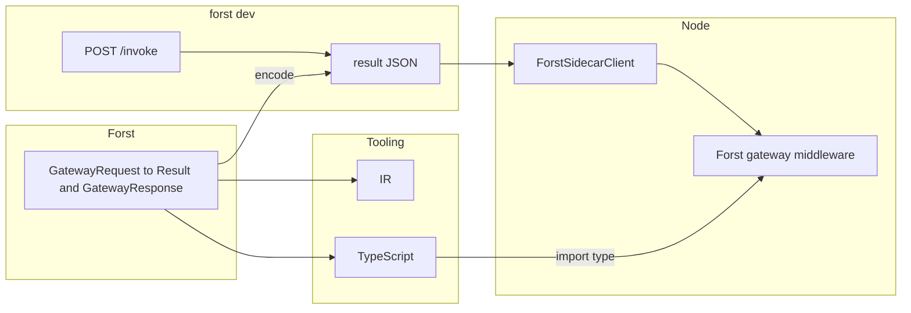

# RFC FR-GW-1: Forst HTTP gateway package (`forst/gateway`), `invoke` `result`, signature / IR / TypeScript pipeline

| **ID** | `FR-GW-1` (working) |
| **Status** | Draft |
| **Audience** | Language / compiler implementers, `@forst/sidecar`, `forst dev` HTTP server |
| **Normative HTTP (envelope, `POST /invoke`)** | [02-forst-dev-http-contract.md](./02-forst-dev-http-contract.md) |
| **Normative `forst generate` baseline** | [03-forst-generate-contract.md](./03-forst-generate-contract.md) |
| **Sidecar bridge** | [12-forst-http-outcome-pipeline.md](../sidecar/12-forst-http-outcome-pipeline.md) |
| **Deep tradeoff analysis** | [Appendix D — Compiler tradeoffs and alternatives](#appendix-d-compiler-tradeoffs-and-alternatives) (non-normative; informs prioritization) |

---

## 0. Table of contents

1. [Abstract](#1-abstract)  
2. [Introduction](#2-introduction)  
3. [Scope, conformance, and out-of-scope](#3-scope-conformance-and-out-of-scope)  
4. [Normative references](#4-normative-references)  
5. [Terms and definitions](#5-terms-and-definitions)  
6. [Rationale](#6-rationale)  
7. [Design principles](#7-design-principles)  
8. [Naming vs Go `net/http` and Node `http`](#8-naming-vs-go-nethttp-and-node-http)  
9. [User-visible library surface (gateway package)](#9-user-visible-library-surface-gateway-package)  
10. [Static semantics: handler contract](#10-static-semantics-handler-contract)  
11. [Dynamic and invocation semantics](#11-dynamic-and-invocation-semantics)  
11.1. [Invariants across streaming and non-streaming `invoke`](#111-invariants-across-streaming-and-non-streaming-invoke)  
12. [Wire: `result` JSON](#12-wire-result-json)  
13. [HTTP request data validation, TypeScript, and `@forst/sidecar`](#13-http-request-data-validation-typescript-and-forstsidecar)  
14. [Toolchain: IR, TypeScript emission, paths](#14-toolchain-ir-typescript-emission-paths)  
15. [Entrypoint resolution](#15-entrypoint-resolution)  
16. [Extensibility: signature-driven stacks](#16-extensibility-signature-driven-stacks)  
17. [Language and compiler design](#17-language-and-compiler-design)  
18. [Security and errors](#18-security-and-errors)  
18.1. [`Err` payload and mapping to `invoke` errors](#181-err-payload-and-mapping-to-invoke-errors)  
19. [Verification and tests](#19-verification-and-tests)  
20. [Documentation requirements](#20-documentation-requirements)  
21. [Open design points](#21-open-design-points)  
- [Appendix A: Dataflow](#appendix-a-dataflow)  
- [Appendix B: Feature matrix](#appendix-b-feature-matrix)  
- [Appendix C: Glossary and pointers](#appendix-c-glossary-and-pointers)  
- [Appendix D: Compiler tradeoffs and alternatives](#appendix-d-compiler-tradeoffs-and-alternatives)  

---

## 1. Abstract

This RFC specifies: (1) a first-class, opt-in Forst *gateway* library (merge path e.g. `forst/gateway`, §8) for HTTP handlers that sit **behind** the Node **sidecar**; (2) **request/response** surface types **`GatewayRequest` / `GatewayResponse`**, and **`GatewayHandler`**, with **`GatewayResponse`** modeled as a **Forst binary** type (discriminated union / *sum* as the language implements it) — the idiomatic success path is **`Result<GatewayResponse, E>`** (or equivalent) at the handler boundary, with the binary union as the `Ok` payload (§5, §9, §10); (3) one canonical encode from the **`Ok` `GatewayResponse` value** to the `POST /invoke` `result` JSON (§12); (4) a single program metadata (IR) and TypeScript emission path, without per-library compiler plugins or decorators; (5) a design space and roadmap for *general* Forst typechecker features, without adding HTTP to the *core* grammar. This document does **not** define legacy or parallel `result` wire shapes: **one** success `result` layout, normatively aligned with [02]. **Forst gateway middleware** in Express is the *Node* integration surface. The document disambiguates *module* naming from [Go’s `net/http`](https://pkg.go.dev/net/http) and from Node’s `http` import (§8) — the merge path and **gateway** product term are *not* a *parser* `gateway` *keyword* (§7, §17.2, T4). **Appendix D** is a *non-normative*, compiler–expert *evaluation* of major forks, risks, and dimensions; it does *not* change the conformance story in §3.

---

## 2. Introduction

The *default* authoring model for this RFC is *typed* end to end: **Forst** binary types (discriminated unions) for `GatewayResponse`, *typically* wrapped in the language **`Result`** at the handler boundary, and **HTTP request** data validation at *parameter* edges (§5–§7, §13) — not ad hoc JSON maps or untyped bypasses on the gateway path.

As in many language designs, this RFC *separates*:

- **Library surface** (§9) — the **`forst/gateway`**, stdlib/merge module; *gateway* is the *umbrella* name for the **Forst** half of the path; *no* gateway-only *parser* keywords in the *core* (§7, P3).
- **Static contract** (§10) — `GatewayHandler`: `GatewayRequest` **→** *typically* `Result<GatewayResponse, E>` (or equivalent) where the `Ok` payload is the **Forst** `GatewayResponse` **binary**; the TypeScript *request* snapshot *aligns* *with* [ForstRoutedRequest](../../../../packages/sidecar/src/express-middleware.ts) (§9). Exact `Result` / `Err` spelling TBD in implementation.
- **Dynamic contract** (§11) — decode, call, encode: on `Ok` marshal the `GatewayResponse` binary to **`result` JSON**; on `Err` use [02]’s `error` path; L6 *shims* (optional) must not bypass that split.
- **Forst gateway middleware** — on Node/Express, the **sidecar** middleware (see [sidecar 12]) that connects **`invoke` `result`** to Express; **one-word** **gateway** in prose is fine after Forst is introduced.
- **Toolchain** (§14) — versioned IR; boring TypeScript lowering from the *same* internal model as IR.
- **Extensibility** (§16) — e.g. future tRPC-style procedures, *same* pipeline, separate npm.
- **Compiler evolution** (§17) — gaps, tiers, and options; *not* a core `gateway` *token* for HTTP (T4: reserved *keyword*, not the **product** name **gateway** or **`forst/gateway`** path).

Sections 9–13 are the sharpest “author + runtime + **Forst** gateway + consumer” slice; §17 is the “what the type system and driver might add” slice; [02] and [03] remain the normative HTTP and `forst generate` contracts.

---

## 3. Scope, conformance, and out-of-scope

| In scope | Out of scope in this document |
|----------|---------------------------------|
| Authoring model, *gateway* naming (§8, §9), **`GatewayRequest` / `GatewayResponse` / `GatewayHandler`**, **Forst** gateway **middleware** story | Exact `forst` CLI flags; final on-disk tree (deferred to implementation + [03], informed by this RFC) |
| Discriminated `result` JSON (§12); no legacy or parallel wire shapes | Full tRPC- or gRPC-style product in Forst (placeholder in §16 only) |
| IR and TS *architecture* and versioning story (§14) | LSP/IDE as a formal *conformance* harness (recommended track only) |
| Gaps and language options (§17) *as* cross-cutting recommendations | A dedicated *HTTP-only* *keyword* in the *core* grammar (rejected, §7) — *not* the `forst/gateway` *path* or the **gateway** product name |
| `invoke`-shaped success and error for HTTP gateways (§11–12, §18) | **Full** browser/WebSocket/SSE products, generic HTTP reverse-proxy semantics, trailers/cookies as a *normative* surface in this RFC (see §21) |

**Conformance (informal, implementer-oriented):** (C1) Public *gateway* types in Forst and the single `result` success shape documented in §9–12 are *consistent*; this RFC does **not** require supporting older or alternate `result` layouts. (C2) For each listed invoke target, there is a single encode from the `Ok` `GatewayResponse` binary to `result` JSON (§11–12) and it is not bypassed. (C3) Where TypeScript app code validates or narrows **HTTP request** data (query, path params, body JSON *structure*), prefer named *request* *guards* and type predicates as in §13 — not a sprawl of ad hoc checks. (C4) Emitted IR, when used, is versioned; the IR schema stays free of HTTP meaning (§14.1). CI harness details are implementation work.

**Conformance (normative, overlaps [02] where noted):** Implementations **MUST** encode success gateway responses so that the `POST /invoke` **`result`** field matches §12 when `streaming` is false (or when the implementation chooses to emit a §12-shaped `result`). Implementations **MUST** surface handler failures through [02]’s **`success: false`** / **`error`** path as described in §18.1, without placing failure payloads in **`result`**. Implementations **SHOULD** bump [02] **`contractVersion`** when the **`result`** success JSON shape for gateways changes incompatibly. Sidecar and generated TypeScript **SHOULD** stay aligned with §12 and [03] as both evolve.

---

## 4. Normative references

- [02] [HTTP contract for `forst dev`](./02-forst-dev-http-contract.md)  
- [03] [`forst generate` contract](./03-forst-generate-contract.md)  
- [Sidecar 12] [Express / outcome bridge](../sidecar/12-forst-http-outcome-pipeline.md)  

If this RFC and [02] ever disagree on the *normative* `result` payload for gateway invocations, [02] and implementations **must** be updated in lockstep; bump `contractVersion` in [02] as that document requires. This RFC does **not** define a transition period or parallel `result` shapes.

**Cross-document lag:** Until every companion doc (README snippets, older examples) is updated, some prose may still mention historical field names (e.g. `continue`) for the same *logical* branch as **`kind: "pass"`** (§12). Treat **§12** of this RFC and the **`result`** section of [02] as **normative** for the wire; treat stray legacy wording elsewhere as **non-normative** until removed.

---

## 5. Terms and definitions

*Naming rationale (normative for this document):* **`GatewayRequest`** and **`GatewayResponse`** pair with **`forst/gateway`** (§8) as the merge id. **`GatewayResponse`** is a **Forst binary** type: a discriminated union (sum) as the language implements it today — *not* an unstructured map. **“Binary”** here means Forst’s **tagged / algebraic** representation of that sum (constructors and `match`-style discrimination), **not** necessarily octet serialization, WASM “binary format,” or FFI byte buffers — unless an implementation explicitly maps a variant to bytes (e.g. body payloads). The *contemporary* idiom for the *full* handler return is to wrap that union in the language **`Result`** type (`Ok` carries the `GatewayResponse` binary; `Err` carries a gateway, validation, or I/O error — exact names TBD); see §9–§11 and **§18.1** for **`Err`** mapping to **`invoke`** errors. The `@forst/sidecar` type [ForstRoutedRequest](../../../../packages/sidecar/src/express-middleware.ts) is the **Node** *view* of the request snapshot; it should *match* `GatewayRequest` field-for-field in spirit. An optional npm rename (e.g. `ForstGatewayRequest`) is implementation only.

| Term | Definition |
|------|------------|
| *Gateway* package | The Forst package (e.g. merge path **`forst/gateway`**) defining **`GatewayRequest`**, **`GatewayResponse`**, constructors, and **`GatewayHandler`** (§8, §9). |
| **`GatewayRequest`** | *Request* side: the gateway request snapshot; fields align with [ForstRoutedRequest](../../../../packages/sidecar/src/express-middleware.ts) (e.g. `bodyBase64`) (§9). |
| **`GatewayResponse`** | **Forst binary** (discriminated union) for the success branch: *at least* *answer* (status, headers, body) and *pass* (delegate; optional `locals` / `request` merges) (§9). Not an unstructured map. The `Gateway*` prefix avoids colliding with the global `Response` name in TypeScript. Encode a `GatewayResponse` value to `result` JSON (§12). |
| **`GatewayHandler`** | Canonical type for a listed *gateway* *entry* : `func(req: GatewayRequest) Result<GatewayResponse, E>` (or the language’s spelling), **with `GatewayResponse` as the `Ok` payload** (§10). Deprecated *synonym* in older text: `RoutedHandler`. |
| *Forst gateway middleware* | The **@forst/sidecar** Express *middleware* that **bridges** **`invoke` `result`** to Express. **“Gateway”** alone, once Forst is named, is an acceptable *short* label. |
| IR | Intermediate representation: versioned JSON (or equivalent) of export and signature facts, not a full program AST (§14.1). |
| Standard pipeline | One compiler pipeline to IR and TypeScript; not pluggable per-library at the driver (§7, §16). |
| *Request* guard | In TypeScript, a *function* used to **validate** or **narrow** *incoming* HTTP *request* data (parsed query, body JSON, path *params*) at the point it enters *handler* logic; the return is often a type *predicate* (§13). Distinct from ad hoc field checks with no *named* contract. |

---

## 6. Rationale

1. **Gateway** authoring *must* model **`GatewayResponse`** *as* a **Forst binary** (discriminated union) and *should* wrap it in **`Result`** at the handler boundary as the contemporary idiom (§5, §9); not untyped JSON bags.  
2. *Fidelity* *from* `Ok` `GatewayResponse` *→* `result` *JSON* *→* Node (and `Err` *→* [02] `error`) *must* be *documentable* in one place (§20).  
3. *Return* inference for `Result` and the *binary* union (G1) *may* be *incomplete* *today* — the spec *must* not *over*-*claim*; *explicit* `GatewayHandler` signatures and Node `tsc` *bridge* the *gap* *.*  
4. One IR+TS “faucet” (P4) avoids N×N bespoke per-domain codegens inside the driver.  
5. Readers coming from Go or Node must not confuse **`forst/gateway`** (or a bare `http` *label* in titles) with `net/http` or Node’s `http` (§8).  

---

## 7. Design principles

| ID | Principle |
|----|------------|
| P1 | **Gateway-**first authoring: default to the stdlib/merge **gateway** package (`forst/gateway`); not raw wire shapes in .ft for the main path. |
| P2 | No decorators to mark **gateway** or other remote **procedure** entrypoints. |
| P3 | No new *core* *parser* *keyword* whose sole job is the HTTP *gateway* *surface* — *contrast* the *merge* path `forst/gateway` and *gateway* in *product* docs (§17, Appendix B). |
| P4 | One standard IR and TypeScript emission; no per-library plugin hooks in the driver for lowering. |
| P5 | Domain npm (`@forst/sidecar`, future) may add rich TypeScript; extension lives in packages, not in a forked compiler mode per lib. |
| P6 | Namespaced composition: e.g. gateway + future tRPC client — separate imports, no required merge of all generated into one file. |
| P7 | Wire and `contractVersion` in [02] stay in lock step on breaking changes. |
| P8 | Nomenclature: must not read, in docs or generated Go, as if it were [Go’s `net/http`](https://pkg.go.dev/net/http) or the Node `http` import. |

---

## 8. Naming vs Go `net/http` and Node `http`

| Context | Rule |
|---------|--------|
| Documentation and tutorials | Use a *dedicated* import (e.g. `forst/gateway`, `forst/routex`); do not use a *bare* label `http` in titles in doc sets that mix Forst with Go or Node stdlib. |
| Go interop / generated `package` | Do not use the identifier `http` alone; prefer e.g. `forsthttproute` or a `gateway`-prefixed symbol. |
| This RFC’s prose | A bare `forst/http` id in early drafts is a placeholder; normative preference is `forst/gateway` or another non-stdlib-looking final path (§5). |
| In code samples crossing ecosystems | Show explicit Forst merge paths (e.g. `import "forst/gateway"`), not a bare `http` type or label when the reader may assume Go or Node stdlib. |
| `GatewayRequest` / `GatewayResponse` | Prefer the `Gateway*`-prefixed names so the TS *family* reads like request/response without a bare re-export of `Request` / `Response` (unless **only** in the `forst/gateway` module and documented) (§5). |

---

## 9. User-visible library surface (gateway package)

*Normative outline; exact spelling of constructors and merge path is left to the implementation PR.*

- **`GatewayRequest`**: *Request* snapshot; same *shape* as [ForstRoutedRequest](../../../../packages/sidecar/src/express-middleware.ts) in `@forst/sidecar` (e.g. `bodyBase64`); *authors* validate *structured* parts of this at the Forst or TypeScript *edge* with *request* guards (§13).  
- **`GatewayResponse`**: **Forst** binary / sum *type* — *at least* *answer* (status, headers, body) and *pass* (optional `locals`, `request` *merge* slot on Express `req` — *not* the *word* “*patch*”). *Construct* only *via* stdlib constructors for this type.  
- **`GatewayHandler`**: *Typically* `func(req: GatewayRequest) Result<GatewayResponse, E>` (or the language-specific spelling); the `Ok` payload is the `GatewayResponse` *union* (§10).  
- **Verbs** (on `forst/gateway`, names TBD): e.g. `text`, `json`, `bytes`, `redirect`, `empty`, `pass` / `pass({ locals, request? })` — each *produces* a variant of the *`GatewayResponse` binary* *.*  
- **User-facing “lowering”** is *not* *required* : *encode* `Ok` `GatewayResponse` *→* `result` *JSON* is *implementation* *(* golden *tests) *.*  
- **Forst gateway middleware** (Express in `@forst/sidecar`): if the sidecar is in streaming mode, the `GatewayResponse` parse path need not run; that is a separate documented mode ([02], sidecar 12). After Forst is introduced, *gateway* alone is a fine short label in prose.  

---

## 10. Static semantics: handler contract

A *gateway* entrypoint (§15) is a function `F` that, after stdlib resolution, has a type assignable to **`GatewayHandler`**: `F` takes `GatewayRequest` and returns **`Result<GatewayResponse, E>`** in the concrete Forst spelling (exact `E` — see §18.1).

**Registration (L2):** The compiler or `forst dev` registration pass **must** resolve listed symbols to a type assignable to this **`GatewayHandler`** shape so failures surface as **`Err`** (§18.1), not as invalid **`result`** JSON.

**Tactics (combinable, §15, §17):** Explicit `GatewayRequest` and `Result<GatewayResponse, E>`; registration pass (L2); future L3 / L4 (global inference / opaque unions). The **`GatewayResponse`** union is already the idiomatic Forst tagged-sum form at the library boundary; L4 *opaque* / *newtype* is optional global hardening, not an MVP requirement for this RFC.

**MVP:** The typechecker may not fully infer `Result` or `GatewayResponse`; docs must stay honest (§17, G1).

**Non-normative alternative:** An experimental **unwrapped** `GatewayResponse` return (errors handled outside `Result`) is discussed only in [Appendix D.11](#d11-non-normative-unwrapped-gatewayresponse-at-the-handler-boundary); it is **not** part of the **`GatewayHandler`** contract above.

---

## 11. Dynamic and invocation semantics

1. Decode the `invoke` argument to `GatewayRequest` per [02] (envelope, `args`, optional `streaming` flag).
2. Call the user function. It returns `Result<GatewayResponse, E>`. On **`Ok`**, take the `GatewayResponse` value and encode it to **`result`** JSON (§12). On **`Err`**, map to the **`invoke`** failure envelope per §18.1 — **do not** put failure payloads in **`result`**. A generated shim (L6), if used, **must not** bypass this split.
3. **Wire:** There is exactly one **`result`** success layout for gateway responses as specified in §12 (no parallel legacy shapes).
4. LSP (L8) may assist with signatures and TypeScript request guards; it does **not** replace L2 registration typing.

### 11.1 Invariants across streaming and non-streaming `invoke`

**Must stay the same** across modes:

- **`POST /invoke`** request envelope ([02]): `package`, `function`, `args`, `streaming` flag semantics.
- **Registration** and symbol resolution (§15): which handler runs for a given `(package, function)`.
- **Failure path:** **`Err`** → [02] **`success: false`** with **`error`** string (§18.1); never encode failures as **`result`** success.

**May differ** when **`streaming: true`** ([02], §9):

- The runtime **may not** materialize a full §12 **`result`** JSON object on the Node side before streaming completes; **gateway** middleware **may** bypass parsing **`result`** into **`GatewayResponse`** for that path.
- Request snapshot and **`GatewayRequest`** decoding rules still apply where the executor accepts them; body parsing may follow streaming-specific rules documented in [02] and the sidecar.

**Intent:** Avoid **semantic drift** on *who is registered*, *how failures surface*, and *what the HTTP envelope is*; allow drift only where **wire framing** (chunked vs single JSON `result`) requires it.

---

## 12. Wire: `result` JSON

**Normative:** For gateway invocations in non-streaming mode (§11.1), there is **one** **`result`** JSON object layout for success (discriminated by **`kind`**). This RFC does not define compatibility with older layouts; bump [02] **`contractVersion`** when that shape changes (§4).

**`result` for `Ok`:** A JSON object with a **discriminant** on the success branch (e.g. **`kind`: `"answer"` | `"pass"`** — field names TBD) so `@forst/sidecar` does not infer behavior from optional flat fields.

| Concept | Role |
|--------|--------|
| `kind: "answer"` (name TBD) | Status, headers, body payload. |
| `kind: "pass"` | Delegate to Express `next()`; optional `locals` and `request` merge on `req` (Express update semantics; avoid the word “patch” in Forst naming). |

**Encoding:** From a `GatewayResponse` value to this JSON; **golden** tests per **`kind`** arm in CI.

---

## 13. HTTP request data validation, TypeScript, and `@forst/sidecar`

**Primary “shape guards” story:** validate or narrow **HTTP request data** — parsed query, route parameters, body JSON **structure** — at the boundary where it enters handler logic. Use named functions with **type predicates** (or an equivalent validation API) rather than scattered `typeof` / optional-chaining on `unknown` values.

**Response-side narrowing** of **`invoke` `result`** on Node is **mechanical** once **`kind`** is fixed (§12); this section focuses on **inbound** data.

- Generated or hand **`.d.ts`** and `@forst/sidecar` types for **`invoke` `result`** should align with §12 and [03] over time.
- In app TypeScript, prefer **`isBodyFoo(x: unknown): x is BodyFoo`**-style guards for request bodies and similar.
- **Streaming** ([02] mode): decoding **`result`** to **`GatewayResponse`** may be skipped; see §11.1 and the §9 note on Forst gateway middleware.

---

## 14. Toolchain: IR, TypeScript emission, paths

### 14.1 IR

- Versioned payload (e.g. `forstIrVersion`); exports, file paths, resolved function signatures, references to well-known / stdlib types.  
- Excludes transport-specific *meaning* (this is not a “tRPC” or “HTTP” slot in the core schema; those stay in libraries and npm).  
- Use: diff, lint, alternative emitters, tests, without re-parsing `.ft` text.  

### 14.2 TypeScript and `tsconfig`

- Idiomatic, deterministic layout; `forstTypesVersion` in header or companion file.  
- Document default output dir, `tsconfig` paths, `package.json` `exports` where needed, single strategy for relative vs bare imports (test with `tsc` and bundlers).  
- `GET /types` vs on-disk `forst generate` — relationship and deduplication is an *open* item (§21).  
- Manual `import type` and project references are allowed early; document supported and discouraged patterns.  

---

## 15. Entrypoint resolution

| Mode | Description |
|------|-------------|
| A. Discovery | Scan packages for exports whose type unifies to `GatewayHandler` (with `exclude` list). |
| B. Manifest | Config (JSON) list of `(package, function)` — no new `.ft` syntax. |
| C. Hybrid | Discovery by default, manifest to override or harden. |

*Rejected:* any exported function invokable with no signature check. *Not rejected:* zero hand-maintained list when discovery is enough.

A registration pass in `forst build` / `forst dev` should, where feasible, typecheck candidates. If discovery is too broad, invoke policy (L7) tightens the surface (§18).

---

## 16. Extensibility: signature-driven stacks

The same standard IR+TS pipeline (P4) supports other “signature is law” packages (e.g. future tRPC-style procedures) in a *separate* npm, importing from standard output — not a different compiler driver mode per package. Out of scope: full tRPC product in the first deliverable; composition model is *reserved* here so gateway work does not preclude it.

---

## 17. Language and compiler design

This section is the *compiler-expert* view: what gaps the *gateway* design *surfaces* and what *general* Forst options exist. Nothing here mandates HTTP-specific *syntax* in the core (P3).

### 17.1 Gaps

| ID | Gap | Until closed |
|----|-----|----------------|
| G1 | Return inference and enforcement for `Result` + `GatewayResponse` (gateway handlers) | `GatewayHandler`, explicit `Result<GatewayResponse, E>`, L2, Node `tsc`, docs. |
| G2 | How “strong” is `GatewayResponse` (nominality) | Library constructors only; L4 *opaque* / *newtype* as *global* feature when available. |
| G3 | Which exports are invokable remotely | A/B/C + L7 if needed. |
| G4 | Drift between `.ft`, IR, `GET /types`, hand sidecar types | One pipeline, versioned IR, documented alignment. |
| G5 | Exhaustive `match` on `GatewayResponse` arms | General typechecker; not MVP sidecar wire. |

### 17.2 Strategy tiers (P3: merge path `forst/gateway` is not a *parser* keyword)

| Tier | Content |
|------|--------|
| T0 | Data in config, stdlib package, dev server — no new syntax. |
| T1 | General typechecker: returns, inference, assignability. |
| T2 | Linkage: export policy, (package, symbol) tables, visibility, first-class *or* data-driven. |
| T3 | General primitives: opaque newtype, sealed sum variants, etc. |
| T4 | *Reject* a *core* *parser* *keyword* reserved *only* for the HTTP *gateway* *surface* — *contrast* the *merge* path `forst/gateway` and the *product* name *gateway* (P3, §1). |

### 17.3 Implementation levers (IDs carry through §17, Appendix B)

| ID | Lever | Note |
|----|--------|------|
| L1 | Typedef + documentation only | Fast; authors can still omit. |
| L2 | Registration pass: resolve targets, check assignability | CI-visible; quality ties to G1. |
| L3 | Stronger *global* return inference / checking | All users; semantics cost. |
| L4 | Opaque / *newtype* in the language (global) | Safer `GatewayResponse` at boundaries; JSON story must stay coherent. |
| L5 | Always emit IR (+ usually TS) from compile or `generate` | One truth; schema work. |
| L6 | Generated shim is the only `invoke` entry for a *listed* symbol | Cannot skip marshal; naming invariants. |
| L7 | Remote-invoke *policy* (config or language) | Tighten G3; security and module design. |
| L8 | LSP: surfaced errors, completion on handler shape | Complements L2, not a substitute. |

*Rejected for v1 primary path (§7, Appendix B): decorator registration; per-library pluggable codegens in the driver; HTTP-only parser token.

### 17.4 Creative, non-normative directions (for language design discussion)

These *do not* ship with this RFC. They show how to close G1–G5 in a *general-purpose* way:

1. **Opaque newtype** with a single public constructor (Rust- / ML-like), so `GatewayResponse` is not a transparent record anyone can build from a map.  
2. **Sealed** sum families with exhaustive `match` when the language has them.  
3. **Export *modifier* (general):** e.g. `export remote fn …` (name TBD) to mark a callable surface *without* an *HTTP*-*only* *core* *keyword* and without decorators — P3 is satisfied if the modifier is transport-neutral (T2, L7). *Contra:* needs a real visibility / linkage story for all of Forst, not *only* the gateway.  
4. **Effect rows** or similar — speculative; not proposed here.  
5. **Stable `SymbolId` in IR** to link L6 shims, discovery, and debugging (§14, §11).  
6. **Lighthouse tests:** *must not compile* / *must* compile small fixtures, where the toolchain allows.  

### 17.5 Phased roadmap (illustrative)

| Phase | Content |
|-------|--------|
| M0 | Wire, `@forst/sidecar`, `kind`-discriminated `result`, golden encode; T0, L1, manual wiring. |
| M1 | *Gateway* package (§8, `forst/gateway`), `Result` + verb API + `GatewayHandler`; L1, L2. |
| M2 | On-disk IR + standard TS, path / `tsconfig` cookbooks; T0, L5. |
| M3 | G1–G2 via T1+T3 and L3, L4 as appropriate. |
| M4 | L7 if auto-discovery of all matching exports is too permissive. |

*Takeaway:* an MVP can ship on T0+T1+data config without *any* *gateway*-*only* *parser* *token* in the *core* grammar. The gaps feed a cross-cutting type+codegen roadmap; naming stays honest about [net/http](https://pkg.go.dev/net/http) (§8).  

Compiler-expert *pros* / *cons* and *dimensional* *analysis* of the same *levers* (gaps, tiers) appear in [Appendix D](#appendix-d-compiler-tradeoffs-and-alternatives) (non-normative).

---

## 18. Security and errors

- **L7:** Broad auto-discovery (§15) can expose more exports; configuration **must** allow tightening (manifest, exclude lists, future linkage policy).
- **Malformed `result`:** At runtime, invalid **`result`** for the gateway path should yield **4xx/5xx** with actionable messages ([02] HTTP status and **`error`** string).
- **Wire incompatibility:** Bump [02] **`contractVersion`** and follow the release process when JSON surfaces change incompatibly.

### 18.1 `Err` payload and mapping to `invoke` errors

**Type parameter `E`:** `GatewayHandler` is spelled **`Result<GatewayResponse, E>`**. **`E`** is **implementation-defined** but **should** be a **small closed family** of error kinds (e.g. validation, domain, internal) expressible as human-readable text. Whether **`E`** is a **fixed** library type (**`GatewayError`**) or **generic** with **bounds** is left to the language and `forst/gateway` release; this RFC **does not** require full **algebraic** error hierarchies in v1.

**Categories (informative):**

| Category | Typical source | Maps to |
|----------|----------------|--------|
| **Author-visible** | Failed **request** validation, domain rule | **`Err`** → [02] **`error`** string (and appropriate HTTP status via `sendError`) |
| **Implementation** | Executor bug, timeout, **encode** failure before **`result`** | **`Err`** or infrastructure failure → **`error`** (implementation **must not** leak raw internals to clients in production builds; wording is product policy) |

**Mapping (normative):** On **`Err`**, the **`POST /invoke`** response **must** follow [02]: **`success: false`**, non-empty **`error`** string, **no** success **`result`** payload for that failure. **[02]** currently carries a **string** **`error`** field; **structured** errors (JSON beside or instead of string) are **out of scope** here and require **[02]** revision + **`contractVersion`**.

**Totality:** Handlers may be **partial** in the PL sense (divergence, traps). The **dynamic** contract (§11) still classifies outcomes as **`Ok`** vs **`Err`** at the boundary presented to **`invoke`**; **undefined behavior** inside user code is **not** specified here.

**Security:** Do not echo unvalidated client data into **`error`** strings without escaping policy used elsewhere in the dev server.

---

## 19. Verification and tests

- Golden: `Ok` `GatewayResponse` → `result` JSON (bytes or schema snapshot) per §12.  
- Sidecar and Forst gateway middleware: `mapRequest`, `next(err)`, `kind`-discriminated `result`, header fidelity on the *answer* path.  
- Compiler: bad registration, missing symbol, where checkable.  
- E2E: one walkthrough in docs (§20) that passes the Express test story.  

---

## 20. Documentation requirements

1. *Concept:* `GatewayResponse` is the `invoke` `result` success payload; the handler return is `Result<GatewayResponse, E>` (or equivalent), with `Err` mapped to the [02] `error` path; Forst gateway middleware connects `result` and Express.  
2. *Authoring:* `forst/gateway` import (§8) and `GatewayHandler` or an explicit `GatewayRequest` / `Result<GatewayResponse, E>` signature.  
3. *Registration:* discovery/manifest (§15) + [sidecar README](../../../../packages/sidecar/README.md).  
4. *Node:* `package` and `function` in middleware must match registered symbols.  
5. *Errors:* §18 (including §18.1 mapping).  
6. *Disambiguation:* (§8) in any “quick start” that also mentions Go or Node HTTP.  

---

## 21. Open design points

Final merge path; exact `GatewayHandler` / constructor spellings and `kind` string literals; precedence of A vs B vs C; whether `@forst/sidecar` re-exports generated types; relation of IR to `GET /types`; where marshal lives (dev server in Go vs Forst); when explicit annotations are mandatory; whether any *general* export modifier (§17.4(3)) is introduced and how it relates to P3.

**Explicit non-goals (this RFC):** First-class **WebSocket** or **SSE** as normative **`forst/gateway`** surfaces; **generic reverse-proxy** semantics beyond **`invoke`**-shaped request/response; **full** HTTP/2 **trailers** / **cookies** **spec** as part of **`GatewayResponse`** (beyond what leaks through Express and **`answer`** bodies); web-platform protocols unrelated to the §12 **`invoke` `result`** JSON contract. Future work may layer on the same IR pipeline (§16) without changing the **core** grammar.

---

## Appendix A: Dataflow

(Subgraph *forst dev* named so the token “go” is not read as “Go the language” or as `net/http`.)

---

## Appendix B: Feature matrix

| Forbidden in primary path | Allowed |
|----------------------------|--------|
| Decorators for entrypoints | P2; general language generics and improvements; T1, T3; L1–L8 *where* applicable. |
| HTTP- or routed-only *core* keyword (T4) | P3; `forst/gateway`-style merge paths as *identifiers* (not stdlib). |
| Per-lib lowering plugins in the driver (P4) | Standard IR+TS + domain npm. |
| “We only use inference for returns” (G1) as the sole claim | Explicit types, L2, L8, `GatewayHandler`, and docs until the checker matures. |

---

## Appendix C: Glossary and pointers

*Glossary* (§5): *Marshal* = one canonical encode from `Ok` `GatewayResponse` to `result` JSON. *Shim* (L6) = generated entry that preserves encode for a listed symbol. *Forst gateway middleware* = Express integration in `@forst/sidecar` (short: *gateway* in prose when Forst is clear). **`Err` mapping** = §18.1. *Compiler* tradeoffs and alternatives: non-normative **[Appendix D](#appendix-d-compiler-tradeoffs-and-alternatives)**; experimental unwrapped returns: **[Appendix D.11](#d11-non-normative-unwrapped-gatewayresponse-at-the-handler-boundary)**.  

- [forst/internal/devserver/](../../../../forst/internal/devserver/)  
- [packages/sidecar/](../../../../packages/sidecar/): [client.ts](../../../../packages/sidecar/src/client.ts), [express-middleware.ts](../../../../packages/sidecar/src/express-middleware.ts), [route-request-stream.ts](../../../../packages/sidecar/src/route-request-stream.ts)  

---

## Appendix D: Compiler tradeoffs and alternatives

This appendix is **non-normative**: it is a **compiler- and platform-oriented** evaluation in the style of public language and runtime RFCs (forks, pros and cons, dimensions, risks). It is meant for **implementation planning** and design review. It does **not** change **conformance** (§3) or the obligations in §1–21. If anything here conflicts with a **numbered** section, the body of the document wins. Appendix A–C and §1–21 are the **normative** architectural record; this appendix is **analytical** only.

### D.0 Relationship to §17

- **§17** lists *what* the compiler, driver, and LSP *might* do: gaps (G1–G5), tiers (T0–T4), levers (L1–L8), and an illustrative roadmap (M0–M4). It is the compact, mechanized list.
- **This appendix** explains *why* certain options are *preferred* or *rejected*, using *dimensions* (D.1) and *tables* so reviewers can see tradeoffs without rereading the full spec. It is safe to use as a **stand-alone design note** for compiler folks.

### D.1 Analytical dimensions

Use these lenses when reading the decision tables. They are **orthogonal in intent** (not in implementation effort: improving one dimension can hurt another if done carelessly).

| ID | Dimension | “Good” outcome | Tension / failure mode |
|----|-----------|----------------|------------------------|
| AD1 | **Core grammar** (P3, T4) | HTTP *gateway* is a **library** and merge path, not a transport-only **parser** hook. | Syntax *sugar* is easy to teach; P3 *resists* one-transport *keywords* in the core. |
| AD2 | **Type system** (G1–G2, L3–L4) | *Gateway* handlers are **checkable**; docs do not **over-claim** inference. | L3 and L4 are **global** language work; not *gateway-only*, so cost is amortized or debated across all users. |
| AD3 | **Single source of truth** (IR, L5, G4) | Exports, signatures, and TS alignment can be **diffed** and **LSP**-driven without re-parsing `.ft` for the same facts. | L5 needs **schema governance** and version bumps. |
| AD4 | **Interop and wire** ([02], **result** JSON, @forst/sidecar) | **Two runtimes** (Forst-executed handler vs Go *dev* server) **agree** on *encode* of `result` | Golden tests, contractVersion drift. |
| AD5 | **Security and remote surface** (L7, §18) | *Invoke* targets are **not** wider than policy (manifest, exclude, future linkage). | **Discovery (A)** can be broad by default (false sense of “everything is local”). |
| AD6 | **Author ergonomics** | Small projects ship without ceremony. | **Explicit** types and **L2** *registration* *pass* help large repos; adds steps. |
| AD7 | **Driver / dev server / sidecar complexity** | One *marshal* story, shared tests (C2, §3). | **L6** *shim* and codegen add *implementation* and *stack-trace* costs. |
| AD8 | **Evolvability** (§16) | Other “signature is law” stacks (e.g. tRPC-style) use **P4**’s *one* pipeline, not a forked driver. | *Gateway* in *prose* sounds HTTP-centric; **IR** stays domain-agnostic in schema (§14.1) to mitigate. |

### D.2 Core language: HTTP **syntax** vs **library** path (P3, T4)

| Option | Pros | Cons | Stance in this RFC |
|--------|------|------|---------------------|
| A — New *core* **keyword** (HTTP / gateway *only* in the grammar) | One obvious *syntactic* hook; IDE *might* special-case. | **Couples** the parser to one *transport*; undermines P3, §16, and T4; hard to *generalize*. | **Reject** for the primary path. |
| B — **No** new *HTTP-only* *parser* *token*; `forst/gateway` (stdlib) + *config* (T0) + general **L3**/**L4** later. | **Small core**; P4 (one IR+TS *faucet*); **AD8** (reuse pipeline). | Authors learn “import a package” instead of “use the `http` *language* feature.” | **Adopt** (this document’s bias). |

**Takeaway (AD1 / AD2):** the **merge** id `forst/gateway` and the *product* word *gateway* are not a **core** *parser* keyword (§1, T4). Stronger *typing* is framed as *global* progress (G1, L3, L4), not as HTTP-**syntax**.

### D.3 Public **type** names: `Gateway*` vs bare `Request` / `Response` (§5, §8)

| Option | Pros | Cons | Bias in this RFC |
|--------|------|------|------------------|
| `GatewayRequest`, `GatewayResponse`, `GatewayHandler` | **AD4**: less collision with `fetch` *Response*, undici, DOM, mixed *Node*+browser TS; *grep*-friendly; lines up with *gateway* in docs. | More verbose. | **Default** (§5). |
| Re-export bare `Request` / `Response` *only* from `forst/gateway` | Reads like *familiar* TypeScript in narrow *imports*. | *Name* clashes in real *repos*; subtle *re-export* *graphs* (AD4, author confusion). | **Not** the default; if used later, **document** a single import *pattern* (§8). |
| Keep @forst/sidecar names (e.g. `ForstRoutedRequest` only) without *Forst* renames | No npm churn. | **Vocab** diverges from **Forst**-side *Gateway\** names. | **Acceptable** when the **shape** matches (§5, §9) and *docs* *call* *out* *the* *pairing* *.* *Optional* *`ForstGatewayRequest` *is* *an* *implementation* *choice* *.* |

### D.4 Registration: discovery (A) vs manifest (B) vs hybrid (C) (§15; G3; L7)

| Mode | Pros | Cons | When it wins (AD5 / AD6) |
|------|------|------|---------------------------|
| A — Discovery | Low friction; good for prototypes (AD6). | May expose more exports than intended (L7, §18); false unification under weak G1. | Trusted packages; tight L2; or when L7 policy is added. |
| B — Manifest | Explicit remote surface (AD5); reviewable diffs. | Manual lists; drift on renames unless L2 and tooling. | Security-sensitive; “exactly these entrypoints.” |
| C — Hybrid | Balances AD5 and AD6. | More modes and precedence rules to test and document (§21). | Default bias in §15 when feasible. |

**Compiler implication (L2):** *registration* should resolve `(package, function)` to a *type* such that the compiler (or a registration pass) can run **assignability** to `GatewayHandler`. A hand-wavy “erased” *invoke* *without* that check is *not* recommended for MVP *soundness* *claims*.

### D.5 Where marshal is implemented: Forst, `forst` dev (Go), and *L6* (§11; C2; AD4 / AD7)

| Locus | Strength | Weakness (AD7) |
|-------|----------|----------------|
| Forst only (types + embedded *runtime* where applicable) | The language *owns* semantics of `GatewayResponse` before I/O. | Must match [02] and the Go executor on the wire; two runtimes in tests. |
| Go *`forst` dev* only | One *marshaler* next to `POST /invoke`. | Risk: `.ft` *compiled* elsewhere *skips* the same *encode* *path*; *mitigate* *with* *L6* *and* *goldens.* |
| *L6* *shim* *as* *the* *only* *listed* *entry* *for* a *symbol* | Strong C2-style guarantee *per* *that* *symbol* | *Codegen* *and* *maintenance*; *indirection* in *stacks* * |

**RFC stance:** one canonical encode of `GatewayResponse` to `result` JSON; use L6 where G1 or inference gaps would otherwise open a second encode path (§11).

### D.6 *IR* *emission* *:* *L5* (always-on *direction*) *vs* *IR* *optional* *MVP* (§14, G4)

|  | Pros | Cons |
|---|------|------|
| *L5*-aligned: emit *IR* *on* the *`forst` *generate* / *compile* *path* * | *Best* **AD3** + *G4*; *diff* *IR*;* *L8*;* *emit* *other* *artifacts* *off* the *same* *facts* | *Schema* *governance*;* *larger* *CI* *artifacts* |
| *IR* *skipped* in *early* *MVP* | *Smaller* *first* *ship* | *Higher* *G4* *drift* *risk* *across* `.ft`, *`GET` *`/types`*,* and* *hand* *`*.d.ts* * *without* *strict* *lockstep* |

*Bias* **(AD3* *)* *:* *treat* *L5* *as* the *north* *star*;* *ship* *versioned* *IR* *as* *soon* *as* the *metadata* *schema* *is* *stable* *enough* for *project* *diffs* *—* *not* *necessarily* *M0* *.

### D.7 Rejected: per-library *driver* *lowering* *plugins* (P4)

| Reason to reject (this RFC) | Dimension |
|-----------------------------|------------|
| *Combinatorial* *conformance* (driver* ×* *package* ×* *wire* *)* | *AD3*; *AD7* |
| *Divergent* *or* *N×N* *IR* *shapes* | *AD3* * |
| *Ecosystem* *(§16* *):* *future* *stacks* *e.g* *tRPC*-*like* *should* *compile* *through* *the* *same* *pipeline* *+ *domain* *npm* *;* *not* a *separate* *compiler* *mode* *per* *package* * | *AD8* * |

*Mitigation* *not* *in* *MVP* *as* *normative* *:* *experimental* *emitters* *that* *consume* the *same* *versioned* *IR* *as* the *sole* *driver* *IR* *output* *—* *P4* *stays* *a* *single* *source* *of* *semantic* *facts* *without* *N* *pluggable* *lowering* *in* the *driver* *binary* *.

### D.8 Nominal *`GatewayResponse* *(* *L4* *)* *vs* *structural* *MVP* (G2, §17, M3)

| Approach | Pro (dimension) | Con (dimension) |
|----------|-----------------|-----------------|
| *MVP* *structural* *sum* *+ *stdlib* *constructors* * | *Ships* *fast*;* *maps* *naturally* *to* *JSON* *(AD4* *)*;* *teachable* *before* *L4* *(* *AD2*;* *AD6* *)* * | *G2* *may* *remain* *weak* *if* *invalid* *shapes* *slip* *through* *the* *checker* * |
| *L4* *global* *opaque* */* *newtype* *+* *sealed* *sums* * (when* *T3* *matures* *)* * | *Strong* *boundaries* *(AD2* *)* *at* *FFI* *and* *JSON* *edges* * | *Not* *MVP* *;* *must* *be* *justified* *as* a *language* *feature* *for* *all* *users* * |

*Phasing* (§17* *M3* *):* *M1* *–* *M2* *use* *structural* *sum* *+* *library* *discipline*;* *L4* *lifts* *G2* *to* a *type* *system* *invariant* *across* *all* *users* *when* *ready* *.

### D.9 Risk register (§18, §19)

| Risk | How it shows up | Mitigation (normative or §17) |
|------|-----------------|-----------------------------|
| Spec skew between [02] and this RFC on `result` | AD4; version bump churn | [02] `contractVersion` / bump process; *golden* tests (§19). |
| *G1* *oversold* in *marketing* *(inference* *=* *always* *safe* *)* | *AD2*; *AD6* | *Explicit* `GatewayHandler` *;* *honest* *docs* *(§10* *)*;* *L2*;* *L8* *not* *a* *substitute* for *L3*;* *D.8* * |
| *G4* *three*-*way* *drift* (`.ft`, *IR* *,* `GET` */types* *,* *hand* *d.ts* *)* | *AD3*; *AD4* | *One* *pipeline* (P4 *+* *L5* *direction*);* *versioned* *IR*;* *align* *with* [03] *§14* * |
| *G3* *+* *L7* *too* *permissive* | *AD5* * | *Manifest* *(B) *;* *hybrid* *(C) *+ *exclude*;* *L7* *policy* (§15, §18) |
| *Duplicate* *marshal* (C2) | *AD4*;* *AD7* * | *L6* *+* *goldens*;* *or* *shared* *codegen* */* *lib* *between* *runtimes* (implementation) |

### D.11 Non-normative: unwrapped GatewayResponse at the handler boundary

Some prototypes may allow a handler that returns **`GatewayResponse`** directly (no **`Result`**) and surfaces failures through **exceptions**, **channels**, or **global** hooks. That pattern is **not** **`GatewayHandler`** as defined in §10: L2 **cannot** rely on **`Result`** for soundness claims, and **`invoke`** mapping must **still** pick a single encode path for **`Ok`**. If explored, it belongs in a **separate** experimental document or flag — **not** the default **`forst/gateway`** tutorials.

### D.10 *Summary* (aligns* *with* *§1*–*7* *,* *Appendix* *B* *)

| Decision | What it buys (dimensions) | What it costs |
|----------|--------------------------|--------------|
| *Gateway* *via* *`forst/gateway` *+ *P3* *(no* *HTTP*-*only* *core* *parser* *keyword* *)* | *AD1*; *AD8* | *Teaching* *`forst/gateway` *;* *T4* *clarity* *(§1*;* *D.2* *)* * |
| *`Gateway*`-*prefixed* *types* *(§5* *)* | *AD4*; *teaching*; *grep* * | *Verbosity*; *repetition* in *signatures* *(D.3* *)* * |
| *Single* *marshal* *(§11) *+ *C2* *(§3) *| *AD4* *invariants* * | *L6* *or* *other* *strict* *enforcement* *at* *edges* * |
| *A* */* *B* */* *C* *(§15) *+ *L7* *hatches* | *AD5*; *AD6* | *Precedence* *and* *docs* *(§21) * * |
| *L5* *direction* + *G4* (versioned *IR*) | *AD3*; *L8*; *diff* *on* *exports* | *Schema* work; migrations (AD7) |
| *P4* (no *per*-*lib* *driver* *lowering* *) (§7; D.7) | *AD3*; *AD7*; *AD8*; combinatorial testing *reduced* | *Future* *out-of-tree* *IR* *consumers* *may* *need* a *blessed* *API* (not *MVP* *in* this *RFC) |

---

*End* *(this* *RFC* *)* *: *Normative* *architectural* *content* *is* *§1*–*3* *(with* [02] *,* [03] *),* *§4*–*21* *,* *and* *Appendix* *A*–*C* *;* *Appendix* *D* *is* *non*-*normative* *and* *evaluative* *only* *.* *Exact* *`forst` *CLI* *options* *,* *`package.json`*,* and* *on*-*disk* *layout* *not* *fixed* *by* [03] *are* *implementation* *.* *

