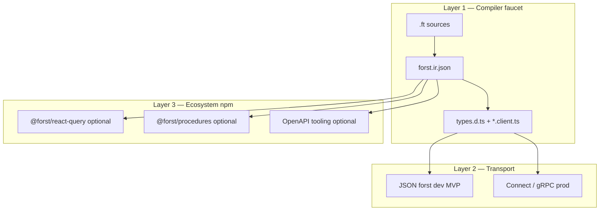

# RFC FR-TS-ARCH-1: TypeScript client layered architecture

| **ID** | `FR-TS-ARCH-1` |
| **Status** | Draft — **decision record** |
| **Audience** | Language leadership, compiler team, npm package maintainers, adopters |
| **Depends on** | [01-integration-profiles.md](./01-integration-profiles.md), [05-forst-http-gateway-signature-pipeline-rfc.md](./05-forst-http-gateway-signature-pipeline-rfc.md), [06-forst-intermediate-representation.md](./06-forst-intermediate-representation.md) |
| **Informs** | All TypeScript client work; ROADMAP TypeScript interoperability rows |

---

## 1. Abstract

This RFC **decides** the long-term architecture for TypeScript client experience: a **three-layer stack** separating (1) compiler-emitted **types and thin invoke stubs**, (2) **transport** between Node and Forst, and (3) **ecosystem npm packages** for framework-specific ergonomics (TanStack Query, tRPC-style procedures, React bindings). The Forst **compiler driver** owns layer 1 only. Layers 2 and 3 evolve independently without per-library driver plugins.

---

## 2. Problem

Adopters compare Forst to several analogues at once:

| Analogy | What users want from it |
|---------|-------------------------|
| **Prisma** | `forst generate` → import typed client |
| **Protobuf / Connect** | Contract-first wire, generated service clients |
| **TanStack Query** | `useQuery` hooks with inferred keys and cache semantics |
| **tRPC** | End-to-end typed RPC routers |

Building all of these **inside the compiler** would produce an unmaintainable driver, fork codegen per framework, and couple Forst releases to React Query API churn. The codebase already ships partial Prisma-like stubs ([`client.go`](../../../../forst/internal/transformer/ts/client.go)) and JSON sidecar transport ([`@forst/sidecar`](../../../../packages/sidecar/)) but lacks a **normative decision** on boundaries.

---

## 3. Decision — three layers

### D1 — Layer 1: Compiler faucet (Forst-owned)

**Owns:**

- Typecheck merge packages
- [IR emission](./06-forst-intermediate-representation.md)
- `forst generate` → `generated/types.d.ts`, `generated/*.client.ts`, `client/index.ts`
- Mapping rules Forst → TypeScript ([03 contract](./03-forst-generate-contract.md))
- Gateway **types** in IR/TS when `forst/gateway` is used ([RFC 05](./05-forst-http-gateway-signature-pipeline-rfc.md))

**Does not own:**

- HTTP server implementation in Node
- React hooks, cache policies, or router frameworks
- Production TLS, auth, or deployment

**Analogy:** Prisma schema → client **types and thin call stubs**, not your Next.js data layer.

### D2 — Layer 2: Transport (shared infrastructure)

**Owns:**

- Dev: JSON `forst dev` HTTP API ([02 contract](./02-forst-dev-http-contract.md)), `@forst/sidecar` reference client
- Prod direction: protobuf + **Connect** (TS-first) or **gRPC** (Go-first) from IR-derived `.proto` ([sidecar/11](../sidecar/11-wire-format.md), [sidecar/13](../sidecar/13-ir-driven-production-wire.md))
- Wire versioning (`contractVersion`), retries, streaming framing

**Does not own:**

- Application business types (those come from layer 1)
- Framework-specific hook generation

**Analogy:** gRPC/Connect **wire**; not the same as application `.d.ts`.

### D3 — Layer 3: Ecosystem npm (optional, community or `@forst/*`)

**Owns:**

- TanStack Query helpers: `queryKey`, `queryFn`, invalidation recipes from IR
- tRPC-style procedure routers from IR ([RFC 05 §16](./05-forst-http-gateway-signature-pipeline-rfc.md))
- OpenAPI emit + fetch clients
- Express augmentation presets beyond minimal sidecar types

**Does not own:**

- Compiler driver modes or AST plugins
- Changing invoke wire format without [02 contract](./02-forst-dev-http-contract.md) revision

**Analogy:** `@tanstack/react-query` sits **above** your fetch client; Forst does not embed TanStack in `forst generate`.

---

## 4. Rejected alternatives

| Alternative | Why rejected |
|-------------|--------------|
| **Single mega-generator** (`forst generate --react-query`) | N×M framework matrix inside driver; violates [RFC 05 P4](./05-forst-http-gateway-signature-pipeline-rfc.md) |
| **Protobuf as only IDL** | Loses Forst refinements; wrong layer for app types ([FR-IR-1 D1](./06-forst-intermediate-representation.md)) |
| **Hand-written sidecar types forever** | G4 drift; blocks proto emit and typed facade ([sidecar/12](../sidecar/12-forst-http-outcome-pipeline.md)) |
| **Decorators / HTTP keywords for registration** | Rejected in [RFC 05 §7, §17.2 T4](./05-forst-http-gateway-signature-pipeline-rfc.md); use config + `forst/gateway` |
| **TanStack Query in compiler** | Cache semantics are app policy; hooks change with React Query major versions |

---

## 5. Integration profiles (which layers you need)

From [01-integration-profiles.md](./01-integration-profiles.md), updated with layer mapping:

| Profile | Layer 1 | Layer 2 | Layer 3 |
|---------|---------|---------|---------|
| **Types only** | ✅ generate | ❌ | ❌ |
| **Node + sidecar dev** | ✅ generate | ✅ JSON sidecar | Optional |
| **Express gateway routes** | ✅ generate + gateway types | ✅ sidecar middleware | Optional |
| **React SPA** | ✅ generate | ✅ sidecar or prod API | ✅ `@forst/react-query` |
| **TS ↔ Go microservices (prod)** | ✅ generate (TS consumer) | ✅ Connect/gRPC | Optional OpenAPI |

---

## 6. Compiler driver rules (normative)

1. **One standard pipeline** to IR and TypeScript ([RFC 05 P4](./05-forst-http-gateway-signature-pipeline-rfc.md)).
2. **No pluggable per-library emitters** registered inside `cmd/forst` (extension via external tools reading IR).
3. **Boring TypeScript lowering** — idiomatic `.d.ts`, no framework imports in generated files.
4. **Generated stubs depend only on `@forst/sidecar`** (or a thin `@forst/client-runtime`) for invoke; never on React or TanStack.
5. **Breaking TS mapping** requires `forstTypesVersion` bump ([03 contract](./03-forst-generate-contract.md)).

---

## 7. npm package rules (normative)

1. Ecosystem packages **read IR** (or generated `types.d.ts` + IR) — they **must not** parse `.ft`.
2. Packages **may** depend on `@forst/sidecar` for transport; **may** swap transport for Connect clients in production.
3. Official `@forst/*` ecosystem packages follow semver independent of compiler releases; document compatible `forstIrVersion` ranges.
4. First-party packages are **optional** — layer 1 + layer 2 alone must be sufficient for production backends.

---

## 8. Sequencing (product roadmap)

| Phase | Layer | Outcome |
|-------|-------|---------|
| **A** | 1 + 2 | Typed `*.client.ts` wired into `ForstSidecar`; dev loop with `watchGenerate` ([08](./08-generated-client-runtime-integration.md)) |
| **B** | 1 + 2 | `forst/gateway` + registration; sidecar imports generated gateway types |
| **C** | 1 | On-disk IR; TS lowered from IR ([06](./06-forst-intermediate-representation.md)) |
| **D** | 2 | IR → proto; Connect/gRPC prod wire ([sidecar/13](../sidecar/13-ir-driven-production-wire.md)) |
| **E** | 3 | `@forst/react-query`, `@forst/procedures` ([09](./09-ecosystem-codegen-from-ir.md)) |

Phases A–C are **prerequisites** for ecosystem work. Phase E is **explicitly deferred** until IR is stable.

---

## 9. Success criteria

- A backend team can adopt with **only** `forst generate` + `@forst/sidecar` — no React, no protobuf required.
- A frontend team can add TanStack Query via **optional npm** without compiler changes.
- Compiler release notes list IR and TS contract versions; ecosystem packages declare compatibility.
- No framework imports appear in `generated/` tree (CI grep).

---

## 10. Related documents

- [06-forst-intermediate-representation.md](./06-forst-intermediate-representation.md)
- [08-generated-client-runtime-integration.md](./08-generated-client-runtime-integration.md)
- [09-ecosystem-codegen-from-ir.md](./09-ecosystem-codegen-from-ir.md)
- [../sidecar/10-decisions.md](../sidecar/10-decisions.md)
- [../sidecar/11-wire-format.md](../sidecar/11-wire-format.md)
