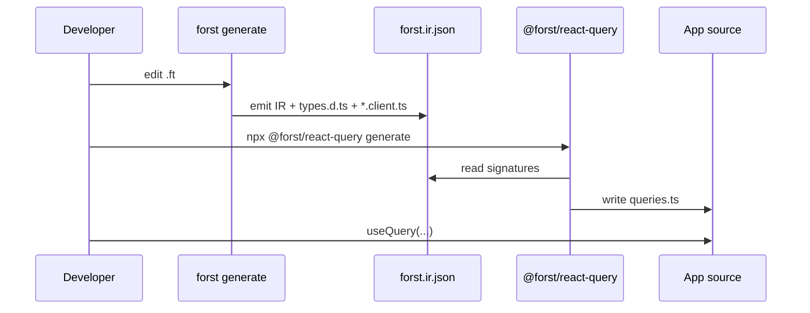

# RFC FR-ECO-1: Ecosystem codegen from IR (TanStack Query, procedures, OpenAPI)

| **ID** | `FR-ECO-1` |
| **Status** | Draft — **decision record** |
| **Audience** | Ecosystem package authors, compiler team (IR stability), adopters using React or custom RPC |
| **Depends on** | [06-forst-intermediate-representation.md](./06-forst-intermediate-representation.md), [07-typescript-client-layered-architecture.md](./07-typescript-client-layered-architecture.md), [08-generated-client-runtime-integration.md](./08-generated-client-runtime-integration.md) |
| **Related** | [05-forst-http-gateway-signature-pipeline-rfc.md §16](./05-forst-http-gateway-signature-pipeline-rfc.md) |

---

## 1. Abstract

This RFC **decides** that **framework-specific client ergonomics** — TanStack Query hooks, tRPC-style procedure routers, OpenAPI fetch clients, and similar — **must not** be implemented inside the Forst compiler driver. Instead, **separate npm packages** (official `@forst/*` or community) consume **[FR-IR-1](./06-forst-intermediate-representation.md) IR** (or generated `types.d.ts` + IR) and emit optional layers **above** the thin `*.client.ts` stubs. This preserves a stable compiler faucet while allowing rich DX comparable to protobuf plugins or TanStack Query codegen ecosystems.

---

## 2. Problem

Users ask for:

- “Generate `useQuery` hooks like TanStack Query codegen”
- “Generate a tRPC router from my Forst functions”
- “Generate OpenAPI + fetch client for my microservice”

Each feature has different:

- **Lifecycle** (React major versions, cache policies, SSR)
- **Transport** (JSON sidecar vs Connect vs REST)
- **Release cadence** (weekly npm vs compiler quarterly)

Embedding these in `forst generate` would violate [FR-TS-ARCH-1 layer boundaries](./07-typescript-client-layered-architecture.md) and [RFC 05 P4](./05-forst-http-gateway-signature-pipeline-rfc.md).

---

## 3. Decision

### D1 — Ecosystem packages are IR consumers, not compiler plugins

| Rule | Detail |
|------|--------|
| **Input** | `forst.ir.json` + optionally `generated/types.d.ts` |
| **Output** | Framework-specific files in app repo (e.g. `src/forst/queries.ts`) |
| **CLI** | Standalone binary or `npx @forst/react-query generate` — **not** `forst generate --react` |
| **Driver** | **No** registration hook inside `cmd/forst` for third-party emitters |

### D2 — Official first-party packages are optional

Forst **may** publish:

| Package | Purpose | Priority |
|---------|---------|----------|
| `@forst/react-query` | Query keys + `queryFn` from IR | After IR-1 stable |
| `@forst/procedures` | tRPC-like procedure router types | After gateway + IR |
| `@forst/openapi` | Shape → OpenAPI 3 + fetch client | ROADMAP innovation row |

None are **required** for backend adoption. Compiler releases **must not** block on ecosystem package readiness.

### D3 — TanStack Query is a cache layer, not RPC definition

**Decision:** TanStack Query codegen **maps IR functions to query/mutation descriptors**, not to wire protocol.

Example target output (illustrative):

```typescript
// Generated by @forst/react-query from forst.ir.json
import type { GameState, Move } from "../generated/types";
import type { ForstSidecarClient } from "@forst/sidecar";

export function playMoveOptions(client: ForstSidecarClient, state: GameState, move: Move) {
  return {
    queryKey: ["engine", "PlayMove", state, move] as const,
    queryFn: () =>
      client.invokeFunction<GameState>("engine", "PlayMove", [state, move]).then((r) => r.result),
  };
}
// App: useQuery(playMoveOptions(client, state, move))
```

**Normative boundaries:**

- Package **must not** fork invoke wire format
- Cache invalidation, optimistic updates, and stale times remain **app code**
- Package **may** integrate with generated `*.client.ts` factories ([FR-CLIENT-1](./08-generated-client-runtime-integration.md)) instead of raw invoke

### D4 — tRPC-style procedures are a separate product surface

[RFC 05 §16](./05-forst-http-gateway-signature-pipeline-rfc.md) reserves **procedure routers** consuming the same IR. **Decision:**

| Aspect | Choice |
|--------|--------|
| Compiler owns procedure syntax | **No** — procedures are TS/npm concern |
| IR includes `procedure`-tagged exports | **Optional future tag** when linkage story exists |
| Wire | Procedures **may** use JSON sidecar in dev, Connect in prod — transport from [layer 2](./07-typescript-client-layered-architecture.md) |

`tRPC` analogy applies to **typed RPC shape**, not to bundling server + client in one Forst binary.

### D5 — OpenAPI emit is an IR emitter, not primary client path

OpenAPI generation **may** be implemented as:

- IR → OpenAPI 3 JSON Schema (future `@forst/openapi`)
- Used for **external** REST consumers, docs, and contract tests

**Decision:** OpenAPI is **complementary** to `forst generate` `.d.ts`, not a replacement. REST path mapping (URLs, methods) is **app config**, not inferred from Forst function names alone.

### D6 — Compatibility matrix

Ecosystem packages **must** declare supported ranges:

```json
{
  "peerDependencies": {
    "@forst/sidecar": "^0.x",
    "@tanstack/react-query": "^5"
  },
  "forst": {
    "forstIrVersion": "^1",
    "forstTypesVersion": "^1"
  }
}
```

Compiler **must not** take a dependency on ecosystem packages.

---

## 4. Codegen workflow (normative)



**CI recommendation:**

1. `forst generate` (fail on type error)
2. `forst ir diff` or snapshot test (future)
3. Ecosystem codegen (optional step, pinned version)
4. `tsc --noEmit`

---

## 5. Rejected alternatives

| Alternative | Why rejected |
|-------------|--------------|
| `forst generate --target=react-query` | Driver complexity; couples compiler to React Query semver |
| AST plugins in Go driver | Security, stability, and review burden |
| Publish hooks inside `generated/` by default | Forces React dep on all backends |
| Community-only with no IR spec | Fragmentation; [FR-IR-1](./06-forst-intermediate-representation.md) required first |

---

## 6. Extension points in IR (future)

When needed, IR **may** add optional **tags** (transport-neutral):

| Tag | Consumer |
|-----|----------|
| `remote: true` | Include in client + procedure emit |
| `streaming: { element }` | Query vs subscription split in React Query package |
| `cache: { keyParts: ["param0"] }` | Hint for query key — **non-normative default** |

Tags require [FR-IR-1](./06-forst-intermediate-representation.md) schema bump; ecosystem packages **must** ignore unknown tags.

---

## 7. Non-goals

- Shipping TanStack Query inside `@forst/sidecar`
- Defining React Server Components data fetching
- GraphQL emit (unless separate RFC)
- Browser-side Forst compiler

---

## 8. Phasing

| Phase | Deliverable |
|-------|-------------|
| **ECO-0** | Document this RFC; stabilize IR schema |
| **ECO-1** | Reference CLI: `ir → query descriptors` without React (plain objects) |
| **ECO-2** | `@forst/react-query` alpha |
| **ECO-3** | `@forst/procedures` alpha alongside gateway |
| **ECO-4** | `@forst/openapi` experimental |

**Gate:** No ECO-1 work until `forst.ir.json` is emitted and snapshotted in CI ([FR-IR-1 IR-1](./06-forst-intermediate-representation.md)).

---

## 9. Related documents

- [07-typescript-client-layered-architecture.md](./07-typescript-client-layered-architecture.md)
- [06-forst-intermediate-representation.md](./06-forst-intermediate-representation.md)
- [08-generated-client-runtime-integration.md](./08-generated-client-runtime-integration.md)
- [05-forst-http-gateway-signature-pipeline-rfc.md §16](./05-forst-http-gateway-signature-pipeline-rfc.md)
